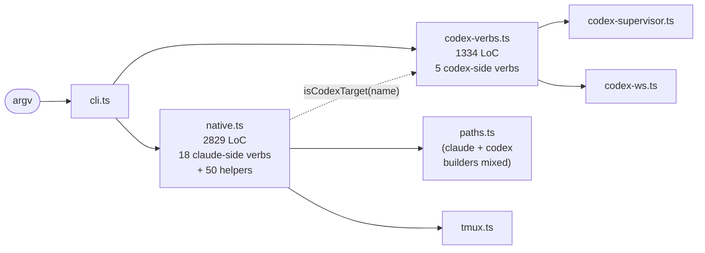
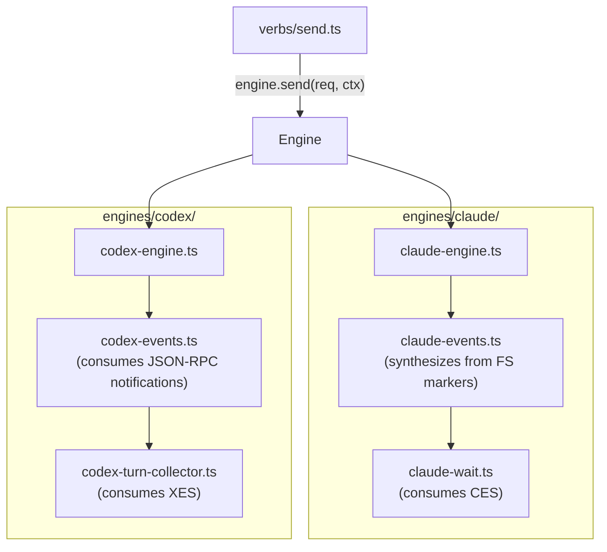
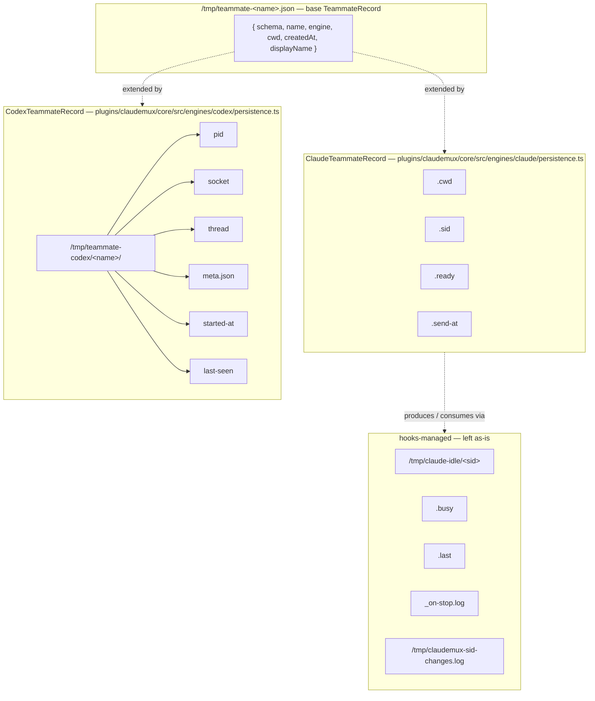

# Multi-engine TUI architecture for `tm`

- **Status:** Accepted
- **Date:** 2026-05-24
- **Affects:** `plugins/claudemux/core/`, `plugins/claudemux/hooks/`, `plugins/claudemux/bin/tm`, decision [codex-engine-flag](/.agents/decisions/codex-engine-flag.md) (partially superseded), the cross-process `/tmp/teammate-*` and `/tmp/claude-idle/*` protocol.

## Context

`tm` started as a Bash script. It has since become a Node CLI
([node-cli-orchestrator](/.agents/decisions/node-cli-orchestrator.md)) shipping as
a committed esbuild bundle
([node-cli-committed-bundle](/.agents/decisions/node-cli-committed-bundle.md)). When
the Codex driver landed
([codex-driver](/.agents/decisions/codex-driver.md)), the Node core grew
a second engine without growing the abstraction that should have come
with it. The current shape:



What broke:

| Cost | Where it shows |
|---|---|
| `plugins/claudemux/core/src/native.ts` is the dump | 2829 LoC, 18 verbs interleaved with 50 helpers; a `tm send` bug fix scrolls past `tm history` formatters. |
| Engine fork at the verb head | `isCodexTarget(name)` re-decides the engine at four near-identical sites (kill / spawn / send / wait). |
| Two parallel verb trees | Claude verbs in `plugins/claudemux/core/src/native.ts`, Codex verbs in `plugins/claudemux/core/src/codex-verbs.ts`, no shared interface — the third engine forks a third tree. |
| Path builders mixed | `plugins/claudemux/core/src/paths.ts` carries Claude marker paths and Codex registry paths side by side, no ownership hint. |
| Identity ambiguous | [codex-engine-flag](/.agents/decisions/codex-engine-flag.md) §2 infers engine identity from "which registry directory happens to exist", which holds for two engines with disjoint persistence and breaks the moment a third engine wants to share an idle-marker root or write its own `.cwd`. |

Two parallel architecture drafts were written and cross-read
([claude](/.agents/proposals/architecture-claude-draft.md),
[codex](/.agents/proposals/architecture-codex-draft.md)). This
record captures the converged decision they produced. Implementation
sequencing is out of scope here.

## Decision

The Node core is reshaped around an `Engine` interface, a single
TeammateRecord JSON keyed by name, and a directory tree where every
file's owning layer is named by where it lives. The sub-decisions below
are load-bearing; the directory tree at the end follows from them.

### Engine interface — `implements Engine`, no optional methods

`Engine` is a TypeScript interface every engine `implements` in full.
There are no `?` optional methods. An engine that cannot perform a
verb still implements its method and returns a structured
"not-supported" or "no-op" result whose `status` discriminates the
case; the verb formatter turns that into a short, friendly stderr
line plus a clean exit code. The CLI return value matters to the
agent reading it — the message is **why this engine cannot do this**,
not a full JSON dump and not a 200-line stack trace.

```ts
export type EngineKind = 'claude' | 'codex'

export interface Engine {
  readonly kind: EngineKind
  readonly capabilities: EngineCapabilities

  spawn(req: SpawnRequest, ctx: EngineContext): Promise<SpawnResult>
  send(req: SendRequest, ctx: EngineContext): Promise<TurnResult>
  wait(req: WaitRequest, ctx: EngineContext): Promise<TurnResult>
  kill(req: KillRequest, ctx: EngineContext): Promise<KillResult>
  list(ctx: EngineContext): Promise<readonly TeammateListing[]>
  status(req: StatusRequest, ctx: EngineContext): Promise<TeammateStatus>

  compact(req: CompactRequest, ctx: EngineContext): Promise<CompactResult>
  resume(req: ResumeRequest, ctx: EngineContext): Promise<ResumeResult>
  last(req: LastRequest, ctx: EngineContext): Promise<TextResult>
  ctx(req: ContextRequest, ctx: EngineContext): Promise<ContextResult>
  history(req: HistoryRequest, ctx: EngineContext): Promise<HistoryResult>
  mem(req: MemoryRequest, ctx: EngineContext): Promise<TextResult>
  reload(req: ReloadRequest, ctx: EngineContext): Promise<ReloadResult>

  inspect(req: InspectRequest, ctx: EngineContext): Promise<EngineSnapshot>
  doctor(ctx: EngineContext): Promise<DoctorSection>
}

export type TurnResult =
  | { kind: 'completed'; text: string; items: readonly InteractionItem[]; context: ContextResult | null }
  | { kind: 'failed';    message: string; recoverable: boolean }
  | { kind: 'timed-out'; elapsedMs: number }
  | { kind: 'not-supported'; reason: string }
  | { kind: 'no-op';     reason: string }

export type CompactResult =
  | { kind: 'compacted' }
  | { kind: 'not-needed'; reason: string }
  | { kind: 'not-supported'; reason: string }
  | { kind: 'failed'; message: string }
```

The Codex engine's `compact` returns `{ kind: 'not-supported', reason:
'codex compacts its own context automatically when the 252k window
fills' }` and the verb formatter prints one line:

```
tm compact reviewer
  not supported: codex compacts its own context automatically when the 252k window fills
```

Exit code is `0` (no-op for not-supported is the right shape — the
caller asked for a thing that does not apply; we tell them so without
flagging it as a script-breaking error). Whether to fail or no-op is
chosen per verb in `plugins/claudemux/core/src/verbs/<v>.ts`; the
engine never decides exit codes.

**Why this shape**, in three reasons. First, Codex really cannot do
manual compaction — its app-server runs an auto-summary when the
252k thread window fills, by design ([codex
draft](/.agents/proposals/architecture-codex-draft.md)
notes the design as upstream's choice and the daemon's only
mechanism). Manual `compact` is a Claude strength
(`<sid>.jsonl` ownership of the transcript makes a `/compact` REPL
flow verifiable); when Codex later exposes a manual hook, that engine
flips its `compact` from `not-supported` to `compacted` with no verb
change. Second, callers don't gain anything from being given an
optional method — they would still need to handle "this engine
doesn't do this" as a path, and a returned-result is one path instead
of two (presence-check then dispatch). Third, the rule "Engine
implements all methods, returns a discriminated result" is the
hard guarantee against the next engine quietly going `if (engine.foo)`
at the verb head and forgetting to handle the no-`foo` branch.

### Verb is the abstraction — and it ships default implementations

The verb layer is not a pure abstract dispatch table. It ships the
default implementations for cross-engine composition: argument parsing,
name resolution, aggregation, output formatting, and the fallback for a
missing teammate stay in `plugins/claudemux/core/src/verbs/`. Engines
implement the required TUI operations; a verb changes its default only
when the public verb behavior genuinely differs. If an engine does not
need differentiated output or behavior for a verb, it uses the shared
verb default and only supplies the Engine API methods that default calls.

Three examples are load-bearing:

```ts
async function lsVerb(ctx: VerbContext): Promise<TmResult> {
  const listings = await Promise.all(
    ctx.engines.registered().map((engine) => engine.list(ctx.engineContext)),
  )
  return formatListing(listings.flat())
}

async function statusVerb(name: TeammateName, ctx: VerbContext): Promise<TmResult> {
  const resolved = await ctx.router.resolve(name)
  if (resolved === null) return teammateNotFound(name)
  return formatStatus(await resolved.engine.status({ name }, ctx.engineContext))
}

async function killVerb(name: TeammateName, ctx: VerbContext): Promise<TmResult> {
  const resolved = await ctx.router.resolve(name)
  if (resolved === null) return teammateNotFound(name)
  const result = await resolved.engine.kill({ name }, ctx.engineContext)
  if (result.kind === 'killed') await ctx.identity.remove(name)
  return formatKill(result)
}
```

This rule is what keeps the third engine from creating a third verb
tree. `tm ls` has one default implementation that enumerates all
registered engines, calls `Engine.list()` in parallel, and aggregates
the rows. `tm status <name>` and `tm kill <name>` share the same
default routing pattern: parse the teammate name, resolve it through
the identity router, call `Engine.status` or `Engine.kill`, and let
the verb own the not-found output. The engine can still decide what
"status" or "kill" means for its own runtime; it does not own the CLI
grammar or the default formatter.

Fleet-visibility verbs are explicitly detached from tmux. `tm ls`,
`tm states`, `tm status`, and `tm kill` must not talk directly to
tmux from the verb layer. The current code sites that must move are
`plugins/claudemux/core/src/native.ts:127` (`tm ls` using `tmux ls`),
`plugins/claudemux/core/src/native.ts:486` (`tm states` enumerating
through `iterRepos()` / tmux), `plugins/claudemux/core/src/native.ts:1067`
(`tm status` using `tmux capture-pane`), and
`plugins/claudemux/core/src/native.ts:1146` (`tm kill` routing the
non-Codex-prefix path straight to tmux). A Codex daemon teammate has
no tmux session, so those verbs cannot see it today even though its
state is present under `/tmp/teammate-codex/<name>/{pid,socket,thread}`.
The default Engine aggregation makes it visible without special-case
tmux knowledge in the verb.

### EventStream is engine-private

The verb layer is the abstraction shared across engines. Each engine's
mechanism for "watching for turn completion" lives **inside that
engine's directory**. Codex's notification stream
(`turn/started`, `item/completed`, `turn/completed` over the
JSON-RPC WebSocket) is wrapped by
`plugins/claudemux/core/src/engines/codex/codex-events.ts` and
consumed by
`plugins/claudemux/core/src/engines/codex/codex-turn-collector.ts`;
that collector
returns a `TurnResult` to the Codex engine's `send` / `wait`
implementation. Claude's mechanism (`SessionStart` / `Stop` /
`PostCompact` hook touches under `/tmp/claude-idle/<sid>{,.busy,.last}`)
is wrapped by
`plugins/claudemux/core/src/engines/claude/claude-events.ts` and
consumed by `plugins/claudemux/core/src/engines/claude/claude-wait.ts`.
No interface above the engine
mentions an event union.



A `tm tail`-style verb that genuinely needs cross-engine streaming is
out of scope. If it ever arrives, it gets a new `Engine.events()` method
added in the same change. Until that verb exists, no streaming
abstraction is built on speculation. **Codex's push stream is a Codex
implementation detail, not a public seam.**

The same rule covers `Transport`: a tmux pane and a WebSocket
JSON-RPC connection do not share a useful API. Each engine owns its
transport module; tests inject it at the engine boundary. Process
primitives that genuinely are shared (`spawn-and-capture`, atomic
file write) live in `plugins/claudemux/core/src/runtime/` and
`plugins/claudemux/core/src/persistence/atomic-file.ts`.

### TeammateRecord — one base JSON, engine-private extensions, hooks-managed files left alone

Today, a teammate's `tm`-owned base state is split across three flat
files (`/tmp/teammate-<n>.{sid,cwd,engine-by-proxy}`). The reshape
collapses what `tm` itself writes and consumes into one JSON:

```
/tmp/teammate-<name>.json    # base TeammateRecord (one source of truth for tm)
```

```ts
export interface TeammateRecord {
  readonly schema: 1
  readonly name: string
  readonly engine: EngineKind
  readonly cwd: string
  readonly createdAt: number
  readonly displayName: string | null
}
```

`tm` writes this file atomically at spawn (`reserve → commit` against
`plugins/claudemux/core/src/persistence/atomic-file.ts`), reads it on
every verb that resolves a teammate by name, and removes it only on
`tm kill` (or `tm doctor` after a deliberate orphan-reaping prompt).
It is the single source of truth for engine routing. The on-disk
format is documented JSON and
machine-readable from Bash via `jq` when a hook needs it; hooks today
do **not** need it (the env-identity gate plus the cwd-byte-match
already pin the right teammate, and hooks read `cwd` from their own
payload, not from the record).

Engine implementations may extend the per-teammate state with files
**they own**, written by the engine through its own persistence
module, never by the registry layer. The Claude engine extension
includes `/tmp/teammate-<name>.cwd` (kept as plain text, so the
SessionStart hook's `sed`-only fast path stays cheap),
`/tmp/teammate-<name>.send-at` (touched for pane-quiet timing), and
the Codex engine extension is the existing
`/tmp/teammate-codex/<name>/{pid,socket,thread,started-at,last-seen,meta.json}`
tree.

Hooks-managed files are **not** moved into the JSON. Bash hooks
cannot rewrite JSON atomically — the on-stop hook already pays for
one `jq` call on every fire, and a JSON read-modify-write would
multiply that cost (and introduce a race with `tm` writers on the
same file). The hook-write set stays exactly as today:

| Path | Writer | Consumer | Belongs to |
|---|---|---|---|
| `/tmp/teammate-<name>.json` | `tm` (registry layer) | every verb that resolves by name | base TeammateRecord (D3) |
| `/tmp/teammate-<name>.cwd` | `tm` at spawn (Claude engine) | SessionStart hook, Claude engine | ClaudeTeammateRecord extension |
| `/tmp/teammate-<name>.send-at` | `tm` per send (Claude engine) | Claude engine (pane-quiet) | ClaudeTeammateRecord extension |
| `/tmp/teammate-<name>.sid` | `tm` at fresh / explicit-sid spawn, SessionStart hook on `/clear` and `claude --continue` | Claude engine (every verb) | ClaudeTeammateRecord extension, hook-mutable — stays a separate plain-text file because the hook updates it on `/clear` without `tm` running |
| `/tmp/teammate-<name>.ready` | `tm` (`rm` at spawn) + SessionStart hook (`touch`) | `tm spawn` readiness probe | ClaudeTeammateRecord extension, hook-touch protocol — stays a separate file because `touch` is the protocol verb |
| `/tmp/claude-idle/<sid>` | on-stop hook (`touch`) | `tm wait` (Claude engine) | hooks-managed, **left as-is** |
| `/tmp/claude-idle/<sid>.busy` | on-busy hook (`touch`), on-stop hook (`rm`) | `tm states`, `tm ls` | hooks-managed, **left as-is** |
| `/tmp/claude-idle/<sid>.last` | on-stop hook (`write`) | `tm last`, `tm wait`'s reply | hooks-managed, **left as-is** |
| `/tmp/claude-idle/_on-stop.log` | on-stop hook (append) | post-hoc inspection | diagnostic, **left as-is** |
| `/tmp/claudemux-sid-changes.log` | SessionStart hook (append) | post-hoc inspection | diagnostic, **left as-is** |
| `/tmp/teammate-codex/<name>/pid` | Codex engine | Codex liveness | CodexTeammateRecord extension |
| `/tmp/teammate-codex/<name>/socket` | Codex daemon (`--listen unix://...`), Codex engine reads | Codex engine | CodexTeammateRecord extension |
| `/tmp/teammate-codex/<name>/thread` | Codex engine after first `thread/start`, explicit `tm resume <name> <thread-id>`, or no-id `tm resume <name>` after Codex `thread/list` picks the latest cwd thread | Codex engine | CodexTeammateRecord extension |
| `/tmp/teammate-codex/<name>/started-at` | Codex engine at spawn | doctor | CodexTeammateRecord extension |
| `/tmp/teammate-codex/<name>/last-seen` | Codex engine per round-trip | doctor | CodexTeammateRecord extension |
| `/tmp/teammate-codex/<name>/meta.json` | Codex engine at spawn/resume | doctor, status | CodexTeammateRecord extension |
| `~/.claude/projects/<encoded>/...` | Claude Code | `tm history`, Claude engine `ctx` | Claude Code product surface, **left as-is** |
| `~/.codex/sessions/YYYY/MM/DD/rollout-*.jsonl` | Codex CLI | Codex `tm last`, `tm ctx`, `tm history`, resume routing hint | Codex product surface, **left as-is** |

The rule by row, in two sentences: **`tm`-owned, engine-implementation-
agnostic** base state lives in the JSON; **engine-implementation-
specific** state lives under the engine's directory; **hook-mutable
state** stays a separate file the hook can write with `touch` /
`rm` / `>` and an inline `sed` field extract. The hooks layer is
upstream of the Node core, not part of it.



### Engine identity is the JSON's `engine` field; codex-engine-flag §2 / §3 retire

`tm`'s router resolves a teammate name to an engine by reading
`/tmp/teammate-<name>.json` and returning the `engine` field. There is
no "infer from which registry directory exists" path, and there is no
deprecation window for legacy `codex-` prefix names.

This **supersedes [decision codex-engine-flag](/.agents/decisions/codex-engine-flag.md)
§2 and §3**. §1 (the `tm spawn <name> --engine claude|codex` flag
shape) and §4 (cross-engine name reuse forbidden) carry forward
unchanged.

A teammate's identity is decided once at `tm spawn` and is then
stable: a name with a `.json` is taken, no matter whether its
engine's liveness layer is healthy. `tm spawn <name> --engine codex`
rejects if `/tmp/teammate-<name>.json` already records `engine:
"claude"`. `tm doctor` is the surface that can reap a stale identity
file and the engine-specific state under it; it never reinterprets
the teammate as a different engine.

The brief allows backwards-incompatibility because the affected
versions are not publicly released. There is no compat shim, no
fallback to prefix-matching, and no auto-migration of pre-existing
`/tmp/teammate-codex-<n>/` registry directories. A user with such a
directory runs `tm doctor` to reap it before spawning under the new
shape.

### Round-trips are atomic by default; `--no-wait` is removed

`tm send <name> --prompt p` and `tm spawn <name> --engine k --prompt p`
are **always** atomic — one engine operation owns the prompt
delivery, completion wait, and result extraction. `--no-wait` is
removed from both verbs across both engines.

`tm wait <name>` remains, for the case where a previous `send` or
`spawn` aborted (timeout, transport drop) before reading the reply
and a follow-up wants to pick up the next completion. It is the
recovery seam, not the default path.

Today's Codex driver carries a 1800s default timeout on its atomic
round-trip; the brief instructs to drop that default in this reshape.
Codex's own `app-server` does not impose a turn-length ceiling, and
Claude Code's Bash tool ceiling (a separate concern of the agent
running inside the Claude REPL) is not `tm`'s to enforce. A
caller-specified `--timeout` knob is allowed but defaults to
unbounded; long-task timeout policy is a follow-up that lives in the
Codex engine, not in the architecture decision.

### `history` and `mem` stay; Codex `mem` is `not-supported`; `cwd` flows through spawn options

`tm history`, `tm last`, `tm mem`, `tm reload`, `tm ctx`, `tm compact`,
`tm resume`, `tm ls`, `tm states`, `tm spawn`, `tm send`, `tm wait`,
`tm kill`, `tm doctor`, `tm archive`, `tm ask` all stay verbs in the
public CLI. None is removed by this reshape.

`tm history` is useful enough that it lives on. The Claude engine reads
`~/.claude/projects/<encoded>/` and lists transcript sid values. The
Codex engine reads `~/.codex/sessions/YYYY/MM/DD/rollout-*.jsonl`,
filters rollouts by their recorded cwd, and lists thread ids that can be
passed to `tm resume <name> <thread-id>`; no-id Codex resume uses the
app-server's `thread/list` latest-thread selection instead of the history
scanner. `tm mem` is rarely used today
but keeps a stable surface — Claude reads project memory under
`~/.claude/projects/<encoded>/memory/`; Codex returns `not-supported`.
The verb formatter prints one explanatory line and exits 0 for unsupported
capabilities.

**`cwd` is engine input, not hook-derived.** Today, Claude's
SessionStart hook learns a teammate's cwd from `/tmp/teammate-<n>.cwd`
that `tm spawn` writes. The reshape makes `cwd` a first-class
`SpawnRequest.cwd` field passed by the verb to `engine.spawn`. The
engine then materialises whatever on-disk markers its sub-systems
(tmux, hooks, the Codex daemon's `--cd` flag) need. Codex's daemon
spawn supports `cwd` directly via the `--cd` flag on `codex
app-server`; the engine passes it through. The Bash hooks continue to
read `.cwd` because their reading protocol is fixed, but `tm`'s
**source** for cwd is the verb argument, not a re-read of the marker
file.

### Capabilities are structured, not stringly-typed

The `EngineCapabilities` record uses discriminated unions and
booleans, not `string` fallbacks. A verb that switches on a capability
gets exhaustive `switch` checking from the type system:

```ts
export interface EngineCapabilities {
  readonly atomicSend: true
  readonly atomicSpawnPrompt: boolean
  readonly compaction: 'manual' | 'auto' | 'unsupported'
  readonly contextUsage: 'transcript-jsonl' | 'rpc-token-usage' | 'unsupported'
  readonly history:    'transcript-files' | 'rpc-thread-list' | 'unsupported'
  readonly memory:     'claude-project-memory' | 'engine-native' | 'unsupported'
  readonly reload:     'prompt-command' | 'native-command' | 'unsupported'
  readonly resume:     'transcript-id' | 'thread-id' | 'unsupported'
  readonly detachedTurn: 'unsupported' | 'replayable' | 'best-effort-push'
  readonly events:     'push' | 'synthesized' | 'none'
}
```

`atomicSend` is `true` for every engine that exists or will exist —
the verb contract demands it; the type literal `true` (not `boolean`)
is the load-bearing assertion that we will not add an engine that
fakes a one-shot `send`. Anything that genuinely cannot do atomic
send does not qualify as a `tm` engine.

What we **don't** do is `compaction: string` with a side comment
"e.g. 'native-command' or 'unsupported'". The string fallback erodes
the type-system guarantee at the verb head and turns
"engine adds a new compaction mode" from a compile error into a
silent fall-through.

### Codex daemon stays per-teammate; shared daemon is a deferred optimisation

Today, each Codex teammate has its own `codex app-server` daemon
process (one daemon, one `--listen unix://<socket>`,
one teammate). The reshape preserves this. Within
`plugins/claudemux/core/src/engines/codex/codex-supervisor.ts` the
runtime state is per teammate
(pid, socket path, thread id, last-seen). Whether engines share or
isolate their internal runtimes is **invisible to verbs** — verbs
talk to the engine via the `Engine` interface; the engine decides
how to multiplex inside.

The Codex draft's adversarial review noted that `codex.app`'s
internal structure is one `manager` plus N `--listen stdio://`
session app-servers, and that the stdio transport is documented
single-client (`codex-rs/app-server/src/lib.rs:629–631,868` —
connection drop terminates the server). At N = 2-10 teammates, the
P0 complexity that a shared-daemon scheme would require (single-tenant
stdio lock arbitration, health-check + restart of the shared process,
SPOF across all teammates, mis-kill protection, fan-out filtering of
notifications across thread ids) is not paid back by the memory
savings. Per-teammate daemons keep the failure domain teammate-local
and let `tm doctor`'s reaping primitive stay an `rm -rf
/tmp/teammate-codex/<name>/`-shaped operation.

The shared-daemon optimisation is listed as **deferred**. Triggers
that would re-open this decision: a sustained steady-state of more
than 10–15 teammates per dispatcher, an aggregate RSS measurement that
exceeds 1.5–2 GB, or `tm doctor`'s orphan reaper losing the race
against accumulating daemons. None of those is true today; the
optimisation is not built against speculation.

### Nested teammate names — `tm spawn flow/flow-1`

Repository names with `/` in them (a workspace-relative path under
the dispatcher, like `flow/flow-1`) are valid teammate names. The
current implementation rejects them at the spawn parser; the reshape
opens this up. The teammate name as it appears on the CLI is a
filesystem path under the dispatcher's `cwd`. The single-segment name
remains the common case; nested-segment names are the escape hatch
for layouts where a teammate lives under a sub-directory.

Two places change for this: the spawn argument parser stops rejecting
`/`, and the Claude engine's `tmux new-session` site stops using the
raw name as the session name. tmux session names cannot contain `/`,
so the Claude engine encodes `/` → `__` (or another character chosen
when implementing this — the requirement is "an encoding round-trip
that round-trips losslessly and stays inside POSIX-safe identifiers";
the exact character is implementation-time choice). Path builders
under `/tmp/teammate-<name>` already treat the name as opaque; the
encoding lives behind a single `tmuxSessionName(name)` builder in
`plugins/claudemux/core/src/persistence/paths.ts` so the choice is changeable
in one place.

The Codex engine has no equivalent constraint — the registry
directory is `/tmp/teammate-codex/<name>/` and `mkdir -p` handles
`/` natively (the daemon's socket path becomes
`/tmp/teammate-codex/flow/flow-1/socket`, which is a valid Unix
socket node path under macOS's 104-byte sun_path ceiling for any
realistic `<name>`).

### Development workflow

These process decisions are part of the contract for the implementation
PRs that follow this architecture record, not only PR-body context.

Q1 is C: the dispatcher does not serialize PRs at the PR layer. Each
teammate may work in its own worktree, and that worktree owns merge
conflict resolution when parallel changes meet.

Q2 is teammate-driven verification: each teammate runs its own review
skill before handoff, fixes its own CI failures, and reports "CI all
green, review all green, unit tests all green" before the dispatcher
squash-merges that PR.

Every implementation phase that follows this decision targets the
`next` branch. It does not target `main`.

## Target shape

The directory tree below is the converged target. The file count and
per-file boundaries are **non-load-bearing** — they are a guidance
artefact, free to be renamed or merged at implementation time. The
**layer ownership** of each path (which layer writes it, which layer
reads it, which layer it must not import from) is the
decision-record commitment, and is enforced by the rules listed in
"Enforcement against silent regression" below.

```text
plugins/claudemux/core/src/
  main.ts                                   process entrypoint
  cli/
    dispatch.ts                             top-level CLI routing + help pre-scan
    help.ts                                 user-facing help strings per verb
    result.ts                               TmResult + exit-code helpers
    spawn-options.ts                        shared parsing for --engine and spawn flags
  runtime/
    runtime.ts                              Runtime interface (DI seam)
    production.ts                           production wiring for fs / process / tmux / clock
    process-runner.ts                       spawn-and-capture primitive
    clock.ts                                injectable wall-clock + sleep
    env.ts                                  env-var readers + validation
  persistence/
    atomic-file.ts                          atomic write / read-if-present / mkdir
    identity-store.ts                       /tmp/teammate-<name>.json read / write / list
    paths.ts                                /tmp protocol paths + tmuxSessionName + encodeProjectDir
  identity/
    name.ts                                 teammate-name parser + nested-name encoding helpers
    engine-id.ts                            EngineKind union + KNOWN_KINDS
    router.ts                               resolve name → engine via identity-store
  engines/
    engine.ts                               Engine interface + request / result types
    capabilities.ts                         EngineCapabilities + result-shape helpers
    registry.ts                             EngineKind → Engine impl map
    claude/
      claude-engine.ts                      ClaudeEngine implements Engine
      claude-spawn.ts                       tmux new-session + SessionStart readiness
      claude-send.ts                        tmux delivery + atomic wait
      claude-wait.ts                        idle-marker + last-file consumer
      claude-compact.ts                     /compact REPL flow + verification
      claude-resume.ts                      /resume by sid + jsonl history walk
      claude-events.ts                      synthesised event stream from FS markers
      claude-history.ts                     jsonl history listing + detail parsing
      claude-context.ts                     jsonl usage extraction for tm ctx
      claude-memory.ts                      ~/.claude project-memory reader
      claude-liveness.ts                    tmux + sid-marker inspection
      tmux-transport.ts                     tmux command adapter
      persistence.ts                        ClaudeTeammateRecord extension; path builders live in persistence/paths.ts
    codex/
      codex-engine.ts                       CodexEngine implements Engine
      codex-supervisor.ts                   daemon spawn / liveness / reap
      codex-transport.ts                    Unix-socket WebSocket connection builder
      codex-json-rpc.ts                     JSON-RPC envelope client
      codex-threads.ts                      thread/start, thread/resume helpers
      codex-turns.ts                        turn/start, wait, interrupt helpers
      codex-events.ts                       EventStream over app-server notifications
      codex-turn-collector.ts               item accumulation for live turns
      codex-doctor.ts                       Codex doctor section + orphan cleanup
      persistence.ts                        CodexTeammateRecord builders (registry dir, pid, socket, thread, ...)
      protocol/                             generated app-server bindings (regenerate, do not edit)
  verbs/
    spawn.ts                                parse, select engine, atomic spawn (+ atomic prompt if given)
    send.ts                                 parse, resolve engine, atomic round-trip
    wait.ts                                 parse, resolve engine, recovery wait
    kill.ts                                 default impl: resolve name, call Engine.kill, remove identity on success
    compact.ts                              parse, resolve engine, format compact result
    resume.ts                               parse, resolve engine, route to engine.resume
    last.ts                                 parse, resolve engine, format last reply
    ctx.ts                                  parse, resolve engine, format usage (or unavailable)
    mem.ts                                  parse, resolve engine, format memory section
    history.ts                              parse, resolve engine, format history result
    reload.ts                               parse, resolve engine, fan out reload
    ls.ts                                   default impl: aggregate all Engine.list rows
    states.ts                               default impl: aggregate Engine.status snapshots (rich)
    archive.ts                              dispatcher task-archive verb (no engine)
    doctor.ts                               global checks + per-engine doctor section
    status.ts                               default impl: resolve name, route to Engine.status
    poll.ts                                 diagnostic pattern wait
    ask.ts                                  Codex ask-pool reviewer
  presentation/
    table.ts                                table alignment
    format-turn.ts                          TurnResult rendering
    format-state.ts                         ls / states / doctor rendering
    format-history.ts                       history detail + list rendering
  support/
    column.ts                               optional column binary adapter
    grep.ts                                 optional grep binary adapter
    tm-binary.ts                            resolve installed tm for integration harnesses
```

`plugins/claudemux/bin/tm` stays a thin Bash launcher that
resolves the bundled Node entrypoint and `exec`s Node. It does not
regain verb parsing or engine routing.
`plugins/claudemux/core/src/engines/codex/protocol/` is
regenerated by `codex app-server generate-ts --experimental` and not
hand-edited.

## Consequences

| | |
|---|---|
| **Decision codex-engine-flag §2 / §3** | Retired by this record. codex-engine-flag's status updates to `Superseded by multi-engine-tui-architecture`; §1 (the spawn `--engine` flag) and §4 (cross-engine name reuse forbidden) carry forward unchanged. |
| **`isCodexTarget` predicate** | Removed. Engine routing flows through one read of `/tmp/teammate-<name>.json` via `plugins/claudemux/core/src/identity/router.ts`. Each teammate-targeted verb file in `plugins/claudemux/core/src/verbs/<v>.ts` calls `router.resolve(name).<method>(req, ctx)` once. |
| **Fleet-visibility verbs** | `tm ls`, `tm states`, `tm status`, and `tm kill` stop talking to tmux directly. Their default implementations aggregate or route through the Engine API, so Codex daemon teammates with only `/tmp/teammate-codex/<name>/{pid,socket,thread}` state are visible. |
| **`plugins/claudemux/core/src/native.ts` and `plugins/claudemux/core/src/codex-verbs.ts`** | Both disappear. Their content lands in `plugins/claudemux/core/src/verbs/` (CLI-shape) and `plugins/claudemux/core/src/engines/<kind>/` (engine-flavored). |
| **`plugins/claudemux/core/src/verbs.ts` (stale mcp-native-orchestration-core MCP-tool catalog)** | Deleted. No current code reads it; it is from a superseded decision (mcp-native-orchestration-core). |
| **`plugins/claudemux/core/src/paths.ts` (claude + codex mixed)** | Split. Claude `/tmp` protocol paths, `tmuxSessionName`, and `encodeProjectDir` move to `plugins/claudemux/core/src/persistence/paths.ts`; engine-specific record extensions stay under `plugins/claudemux/core/src/engines/<kind>/persistence.ts`. |
| **`--no-wait` flag on `send` and `spawn`** | Removed. Atomic round-trip is the only path. |
| **Codex 1800 s default timeout** | Removed. `--timeout` remains optional; default is unbounded; long-task timeout policy is a future Codex engine decision, not an architecture rule. |
| **Cross-engine name reuse** | Continues to be forbidden (carried from codex-engine-flag §4); enforced by `plugins/claudemux/core/src/persistence/identity-store.ts`'s reserve step rejecting a name whose JSON already exists. |
| **Hooks bundle** | Unchanged. `plugins/claudemux/hooks/on-session-start.sh`, `plugins/claudemux/hooks/on-busy.sh`, and `plugins/claudemux/hooks/on-stop.sh` continue to write the marker files they write today. They are upstream of the Node core, not part of it. |
| **Shared Codex daemon** | Deferred. Triggers for reopening are listed in §"Codex daemon stays per-teammate". |
| **Nested teammate names** | Enabled. `tm spawn flow/flow-1` works; the Claude engine's tmux-session-name builder encodes `/` losslessly inside `plugins/claudemux/core/src/persistence/paths.ts`. |
| **Integration tests** | Live-teammate harness ([live-teammate-integration-harness](/.agents/decisions/live-teammate-integration-harness.md)) continues to exercise the binary surface; the engine contract gets a shared test file that every concrete engine passes (`spawn → send → wait → kill` round trip against an in-memory transport). |
| **Build / bundle** | Committed esbuild bundle ([node-cli-committed-bundle](/.agents/decisions/node-cli-committed-bundle.md)) continues. The bundler input is `plugins/claudemux/core/src/main.ts`; the layered tree above bundles into one `plugins/claudemux/core/dist/cli.mjs` exactly as today. |
| **Versioning** | This reshape is a behaviour-visible breaking change (verb flags removed, identity scheme changed) and lands as a `claudemux` **minor** changeset on the 0.x line; the brief authorises backwards-incompatibility because 0.8.x is locally unreleased. |

### Enforcement against silent regression

- **Engine no-cross-imports rule.**
  `plugins/claudemux/core/src/engines/codex/*.ts` may not import from
  `plugins/claudemux/core/src/engines/claude/*.ts` and vice versa.
  Enforced by an
  ESLint `no-restricted-imports` rule (or a small custom check in
  `.agents/scripts/check.sh`) added with this reshape.
- **Layer dependency direction.** `plugins/claudemux/core/src/persistence/`,
  `plugins/claudemux/core/src/runtime/`,
  `plugins/claudemux/core/src/presentation/`, and
  `plugins/claudemux/core/src/support/` do not import from
  `plugins/claudemux/core/src/verbs/` or
  `plugins/claudemux/core/src/engines/`;
  `plugins/claudemux/core/src/verbs/` does not import from
  `plugins/claudemux/core/src/engines/<kind>/` directly, only from
  `plugins/claudemux/core/src/identity/router.ts`. Enforced the same
  way.
- **Engine completeness.** The `Engine` interface has no optional
  methods; TypeScript's structural-type checker rejects an engine
  implementation that omits one. No additional check needed.
- **Result-shape discrimination.** Every result type
  (`TurnResult`, `CompactResult`, …) is a discriminated union; the
  verb formatter must exhaustively match on `kind`. TypeScript's
  `never`-tail pattern enforces this at compile time.
- **Identity-by-JSON.** `plugins/claudemux/core/src/persistence/identity-store.ts`
  is the only file in the codebase that writes or reads
  `/tmp/teammate-<name>.json`; a unit test in
  `plugins/claudemux/core/test/persistence/identity-store.test.ts`
  covers the reserve/commit/rollback semantics.

## References

- [Decision node-cli-orchestrator](/.agents/decisions/node-cli-orchestrator.md) — the Node CLI contract this architecture lives on.
- [Decision node-cli-committed-bundle](/.agents/decisions/node-cli-committed-bundle.md) — the committed-bundle rule the `dist/` output continues to honour.
- [Decision codex-driver](/.agents/decisions/codex-driver.md) — the Codex driver record. The `codex-` name-prefix routing inherited from this decision is dropped (see §"Engine identity is the JSON's `engine` field").
- [Decision codex-engine-flag](/.agents/decisions/codex-engine-flag.md) — the `--engine` flag record. §1 and §4 carry forward; §2 (registry-presence inference) and §3 (one-minor deprecation window) are retired by this decision.
- [Decision cross-process-cross-platform-invariants](/.agents/decisions/cross-process-cross-platform-invariants.md) — the path-builder discipline `plugins/claudemux/core/src/persistence/` and `plugins/claudemux/core/src/engines/<kind>/persistence.ts` continue to honour.
- [Decision mcp-native-orchestration-core](/.agents/decisions/mcp-native-orchestration-core.md) — the superseded MCP-tool catalog whose stale `plugins/claudemux/core/src/verbs.ts` this reshape deletes.
- [Claude-side draft (multi-engine-tui-architecture)](/.agents/proposals/architecture-claude-draft.md) — one of the two input drafts cross-read into this record.
- [Codex-side draft (multi-engine-tui-architecture)](/.agents/proposals/architecture-codex-draft.md) — the other input draft.
- [Phase 1 bug audit](/.agents/proposals/phase-1-bug-audit.md) — the bug list that produced the appetite for this rework.
- `plugins/claudemux/hooks/on-session-start.sh`, `plugins/claudemux/hooks/on-busy.sh`, `plugins/claudemux/hooks/on-stop.sh` — the hooks-managed file set inventoried in the TeammateRecord table.
- `codex-rs/app-server/src/lib.rs:629–631,868` — upstream Codex source confirming the `stdio` transport is single-client (the connection-drop termination), cited in §"Codex daemon stays per-teammate" as evidence that a manager-fronted shared-daemon scheme would require non-trivial multiplexing work.
