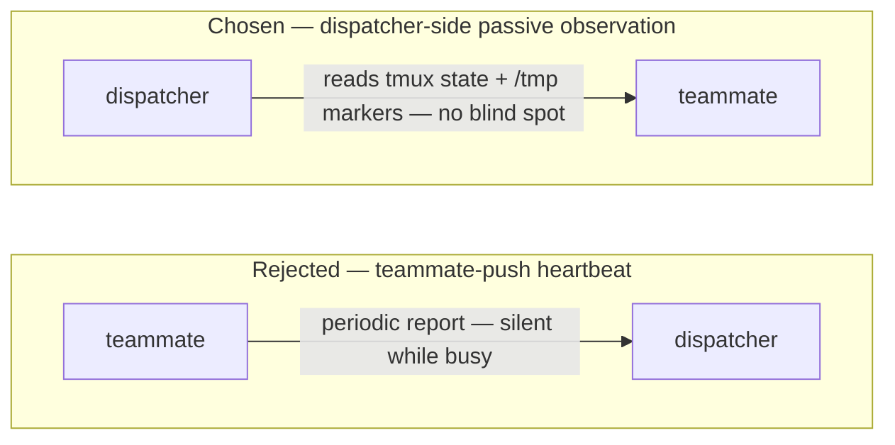
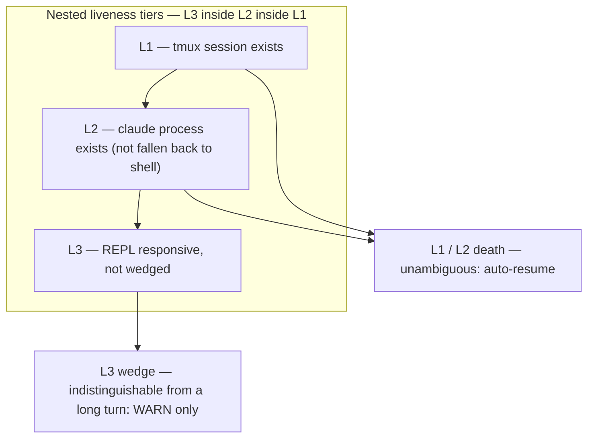
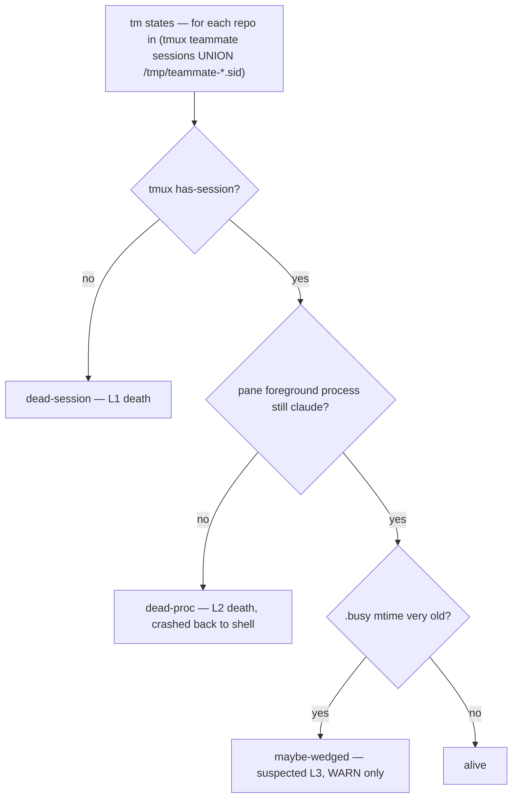
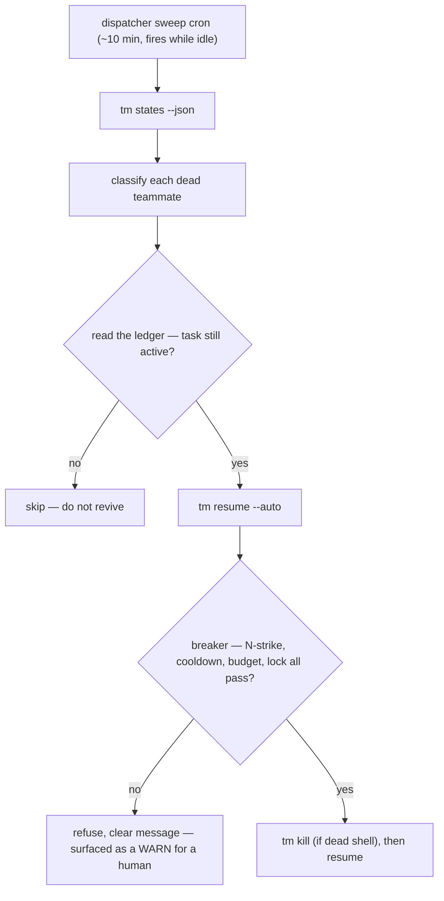
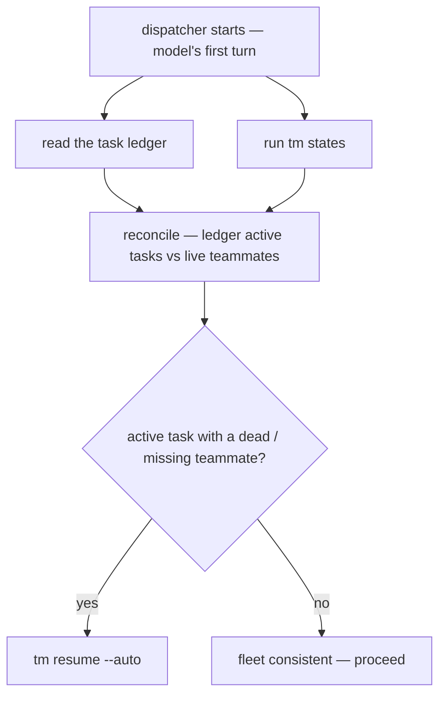
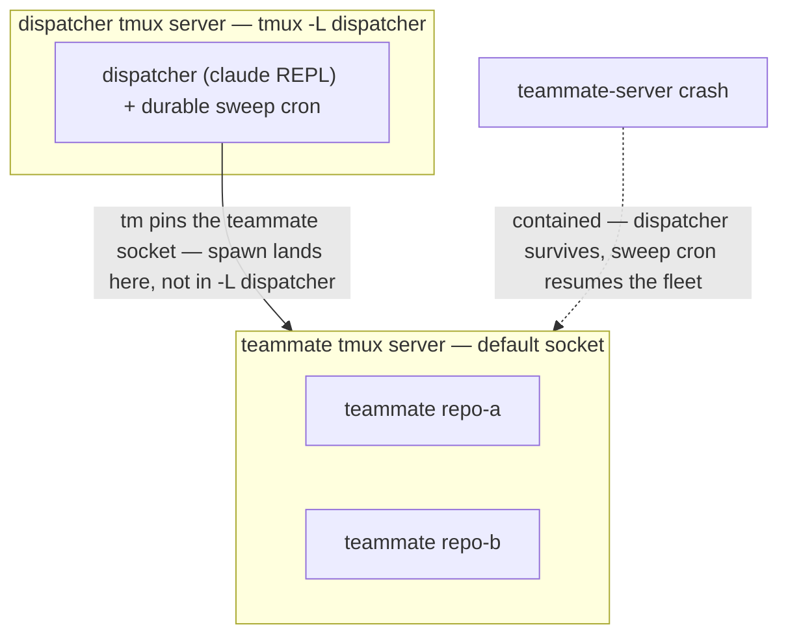

# Design: tm heartbeat — passive dispatcher-side liveness

- **Status:** Implemented
- **Date:** 2026-05-22
- **Affects:** `tm` (`states` and `resume` enhancements, internal helpers, path builders), the `dispatcher` skill, `/claudemux:setup`, deployment topology
- **Decision record:** [0009](/.agents/decisions/0009-tm-heartbeat-passive-liveness.md)

This is the converged design for adding a heartbeat / auto-resume capability
to `tm`. It is the specification to implement against. Decision record 0009
records the *why* in brief; this document is the full design — the liveness
model, the verb contracts, the circuit breaker, the deployment topology, and
the code-landing points. No code is changed by this document.

The capability adds **no new `tm` verb**. It folds into the two existing
verbs whose jobs already cover it — `tm states` (the fleet snapshot) and
`tm resume` (the recovery action) — and into the `/claudemux:setup` flow.
The command surface stays the size it is; only its existing verbs grow.

## The requirement, and why the framing was reversed

The original requirement: add a heartbeat to `tm` — teammates periodically
report that they are alive, and when one dies the dispatcher auto-resumes it.

The investigation **reversed that framing**. The design does *not* build a
teammate-push heartbeat. It builds **dispatcher-side passive observation**.

The reason is that a teammate cannot emit a clean heartbeat signal:

- **A cron-based report** fires only while the REPL is idle. A teammate
  running a long turn goes silent — and silence is then indistinguishable
  from death. This is exactly the false-positive the requirement feared.
- **A hook-based report** is event-driven; there is no periodic hook event.
  An idle, healthy teammate fires no hook at all — it goes silent precisely
  when it is healthiest.
- **An in-pane sidecar process** is decoupled from claude's real liveness.
  If it is a claude child, it dies with claude and measures nothing the
  process table does not already show. If it survives claude, it emits a
  *false positive* — a fresh heartbeat over a dead REPL.

Meanwhile, "is the teammate there" is something the dispatcher can observe
**from outside tmux, for free, reliably, with no blind spot**. A teammate is
a `claude` process in a `tmux` pane; `tmux` already maintains that fact. The
report direction in the original requirement is wrong — there is nothing
worth pushing. Flip it: the dispatcher observes.

## The three-tier liveness model

"Alive" is not one fact. It is three nested tiers, and their observability
differs sharply. This model is the foundation of the whole design.

| Tier | Meaning | Who observes it | False-positive risk |
|---|---|---|---|
| **L1 — tmux session exists** | `tmux has-session -t =teammate-<repo>` | dispatcher, from outside, free | **zero** — the session exists or it does not |
| **L2 — claude process exists** | the pane's foreground process is still claude, not fallen back to a shell | dispatcher, from outside, free | very low |
| **L3 — REPL is responsive** | claude is alive and not wedged (no deadlock, no unanswered permission prompt, no model loop) | **not cheaply observable from outside** | **high** — indistinguishable from a legitimate long turn |

The rule that follows: **auto-resume targets only the unambiguous L1/L2
death. L3 only ever emits a WARN — it is never auto-resumed**, because acting
on L3 means betting on a guess, and a wrong guess resurrects a teammate that
was working fine.

**An L2 detail that drives the probe design.** `tm spawn` does `tmux
new-session` and then `send-keys "claude ..." Enter` — the pane runs a shell,
and claude is that shell's child. When claude crashes, control returns to the
shell; the pane and the session **survive**. So "claude crashed" most often
looks like: `tmux has-session` is still true, but the pane's foreground
process has fallen from claude back to `zsh`/`bash`. L2 detection therefore
must inspect `pane_current_command`. It cannot rely on the session existing,
and it cannot rely on `pane_dead` (the pane is running a live shell, so it is
never dead).

## The design

The investigation framed the work as **Tier 1** — everything that lives
inside the existing process model, observed dispatcher-side — versus
**Tier 2**, a tmux-external `launchd` supervisor. Tier 2 was cut (see
*Rejected alternatives*). What follows is the full Tier 1 design, together
with deployment topology 3b, which structurally absorbs what Tier 2 was meant
to cover.

**Command-surface discipline.** The capability splits cleanly along a seam
that already exists in `tm`: *observing* fleet state is what `tm states`
does, and *recovering* a session is what `tm resume` does. So the design adds
no verb. `tm states` gains the liveness probe and classification; `tm resume`
gains the dead-shell sequencing and an opt-in circuit breaker. New code is
internal helpers and `/tmp` protocol files — neither is part of the command
surface a user has to learn.

### Liveness probing folds into `tm states`

`tm states` is already the dispatcher's fleet snapshot — one row per
teammate, with a BUSY column and the last-turn preview. Liveness is the same
kind of fact, observed the same way (read tmux, read `/tmp` markers), at the
same time the dispatcher is already looking. It belongs in the same verb.

`tm states` gains:

- **A `STATUS` column**, classifying each teammate:

  | Class | Condition | Meaning |
  |---|---|---|
  | `alive` | session exists **and** claude process present | healthy (idle or busy) |
  | `dead-session` | `.sid` exists, `tmux has-session` fails | L1 death — killed session, manual `tmux kill` |
  | `dead-proc` | session exists, claude has crashed back to a shell | L2 death — claude crash / OOM |
  | `maybe-wedged` | claude present, `.busy` mtime very old | suspected L3 — **reported, never acted on** |

- **A widened enumeration.** `tm states` today lists `iter_repos` (the
  tmux-backed set). It must also enumerate the `/tmp/teammate-*.sid` files,
  because a session that has *completely vanished* is not in `tmux ls` at all
  — only an orphan `.sid` file reveals that it was ever a teammate. The row
  set becomes the union `iter_repos` ∪ `iter_sid_repos`; a vanished teammate
  shows up as a `dead-session` row instead of silently disappearing. This is
  a deliberate widening — a dispatcher *wants* "repo-x's teammate is gone" on
  the snapshot.

- **A `--json` flag.** The default output stays the human table (now with
  the STATUS column); `--json` emits the machine-readable form the sweep
  cron and the boot flow parse.

- **A persisted verdict.** Each run writes each repo's class + a timestamp to
  `/tmp/teammate-<repo>.health`. That file is what the `tm resume` circuit
  breaker reads for its N-strike gate (below).

**L2 probe by self-calibration, not a hardcoded process name.** The string
`tmux` reports for a running claude REPL varies — `node`, `claude`, or `bun`
depending on how claude was launched on that machine. Rather than hardcode
it, `tm spawn` records the live `pane_current_command` into
`/tmp/teammate-<repo>.proc` once the REPL is up; the `tm states` probe
compares the current command against the recorded one. A mismatch means
claude has exited.

`tm states` stays a read-only, sub-second, safe-foreground verb — the probe
is a handful of fast `tmux` queries per teammate and adds no side effect
beyond the verdict file.

### Resume sequencing and the circuit breaker fold into `tm resume`

Recovering a dead teammate is a resume. `tm resume` already exists and is
already the verb for it. Auto-resume does not need a second verb — it needs
`tm resume` to (a) handle the dead-shell case correctly and (b) be safe to
call from an *unattended* trigger. Both fold in.

**Dead-shell sequencing — always on, gated by the probe.** Today
`tm resume` refuses with "already running" whenever the session still
exists. But a `dead-proc` teammate's session *does* still exist (the pane is
running a bare shell) — so a resume of a crashed-back-to-shell teammate fails
today. `tm resume` gains the liveness probe and this sequencing:

- `alive` (claude still running) → refuse with "already running" — **unchanged**; a live REPL is never killed.
- `dead-proc` (dead shell) → `tm kill` the session first, then resume. Killing a dead shell loses nothing — claude is already gone — so this is safe to do unconditionally on a manual resume.
- `dead-session` (session already gone) → resume directly — **unchanged**.

This sequencing is error-prone to get right (`tm kill` also deletes `.sid`,
so the sid must be captured before the kill) — keeping it inside `tm resume`,
gated by the probe, puts it in one tested place.

**The circuit breaker — opt-in via `--auto`, never imposed on a manual
resume.** `tm resume` is also called *manually* by the dispatcher: "resume
repo-x, session sid-y." A manual resume is an intentional, authoritative
human-driven action. Baking a rate limiter into it unconditionally would
**change that semantic** — a cooldown or hourly budget could refuse a resume
the dispatcher explicitly asked for. That is wrong.

So the breaker is engaged only by a flag:

- **`tm resume <repo> <sid>`** — manual resume. Probe-gated dead-shell
  sequencing (above). **No rate limiting** — the dispatcher asked, so it
  happens.
- **`tm resume --auto <repo> <sid>`** — guarded automatic resume, for the
  sweep cron callback and the boot flow. Same sequencing, plus the
  deterministic, file-based circuit breaker. `--auto` also defaults the
  `--prompt` to a post-crash recovery instruction (re-check the last action /
  `git status` before continuing) when no `--prompt` is given.

The breaker is deterministic and file-based — the counting is **not**
delegated to the LLM:

- **N-strike confirmation** — proceed only if the teammate was classified
  dead on **two consecutive `tm states` runs** (read from
  `/tmp/teammate-<repo>.health`). Kills millisecond-scale races where a
  single probe caught a transient state.
- **Per-repo cooldown** — `/tmp/teammate-<repo>.resumed-at` is stamped after
  *any* resume, manual or `--auto`; an `--auto` resume within ~5 minutes of
  that stamp is refused. A teammate that dies again inside the window is
  *flapping* — and an `--auto` resume also stands down right after a human
  just acted.
- **Hourly budget** — `/tmp/teammate-<repo>.resume-log` records `--auto`
  resume timestamps; at ~3 per rolling hour, `--auto` refuses. A manual
  resume neither writes nor is checked against this budget.
- **Concurrency lock** — `mkdir /tmp/teammate-<repo>.resume.lock` (atomic on
  every POSIX filesystem, per the cross-platform invariant) is taken by
  **both** paths — it is a correctness guard, not a rate limit — and removed
  on completion. It stops a cron fire and a manual resume, or two cron fires,
  from racing the same repo.

On a breaker refusal, `tm resume --auto` exits non-zero with a clear message,
so the dispatcher can surface it as a WARN for a human to look at.

### Detection — reflex plus a durable cron, no resident process

Detection runs on two layers, and there is **no long-running watcher
process**.

**Reflex layer** — detection rides existing dispatcher actions:

- the STATUS column means **every `tm states` snapshot the dispatcher already
  takes carries a liveness check** — detection for free, no extra call.
- the L2 liveness check is wired into the `tm send` / `tm wait` entry path as
  a **fast-fail**. This also fixes an existing bug: sending to a dead-shell
  teammate today blocks for the full 1800s timeout, because a dead shell
  never fires the Stop hook, so the idle marker `_wait_idle_signal` polls for
  never appears.

**Cron layer** — a dispatcher idle sweep, roughly every 10 minutes:

- created with `CronCreate({durable: true})` — it is persisted to
  `.claude/scheduled_tasks.json` and auto-reloaded across dispatcher
  restarts.
- residual constraint: a recurring cron expires after 7 days; the callback
  re-arms itself.

No resident `tm watch` daemon: a daemon is one more lifecycle to supervise
and would itself need a watcher. The reflex + cron pair covers detection
without that part.

### The resume decision is the dispatcher's, and it is ledger-aware

The trigger that calls `tm resume --auto` is a **dispatcher LLM turn** — the
cron callback or the boot flow — not a magic flag inside `tm`.

`tm` is the mechanism layer. It does not know whether the task ledger says a
teammate's task is still active or was already merged. **Reviving a teammate
whose task is already done is a bug.** So before calling `tm resume --auto`,
the dispatcher reads the ledger and confirms the task is still active. A
blind script loop cannot read the ledger and would wrongly resurrect
completed teammates.

Division of labour, consistent with the existing architecture: **`tm` owns
mechanism** (the circuit breaker, the dead-shell sequencing); the
**dispatcher skill owns policy** (is this task still worth reviving).

### Dispatcher boot recovery

When the dispatcher starts — the model's first turn, riding the human's first
message — it reconciles the fleet: read the task ledger, run `tm states`, and
`tm resume --auto` the teammates that are missing but whose tasks are still
active. This recovers from a dispatcher restart that happened while teammates
were still running.

Optional refinement: a **dispatcher-side `SessionStart` hook** that runs a
mechanical `tm states --json` sweep and injects the report as
`additionalContext`, so turn 1 sees the health report without being told to
look for it. This is a *new* hook file, not a change to the existing teammate
hooks.

### Hooks — zero changes

The three existing hooks — `on-busy.sh`, `on-stop.sh`,
`on-session-start.sh` — are **not touched**. The whole design reads `tmux`
state and the existing `/tmp` markers; it produces no new teammate-side
signal. This keeps the BUSY/idle signal that `tm send` / `tm wait` depend on
at zero risk.

The only hook-related addition is the optional dispatcher-side `SessionStart`
hook above — a new file, not an edit to an existing hook.

### The `.sid` enrollment gate

A `/tmp/teammate-<repo>.sid` file existing means an **enrolled teammate**.
`tm kill` deletes `.sid`, so a deliberately killed teammate drops out of the
`tm states` enumeration and is never resumed. The "do not resurrect what was
killed on purpose" semantic comes for free from the existing `cmd_kill`
cleanup.

The limit, stated honestly: `.sid`'s lifecycle is bound to `tm kill`, **not**
to "task completed". A teammate whose task is finished but which was never
explicitly killed still has its `.sid` on disk. So the real guard against
reviving a completed teammate is **the ledger check above**, not the `.sid`
gate. The `.sid` gate only ensures an explicit `tm kill` is respected.

## Deployment topology 3b — guided by `/claudemux:setup`

This is the structural fix for server-level crashes, and it ships with this
design — as a guided step in `/claudemux:setup`, not as scattered prose.

On 2026-05-22 at 20:44 a real `tmux` server crash took down the dispatcher
**and every teammate at once** — they all lived in one `tmux` server, so a
single crash was a fleet-wide outage. Any watcher that also lives in that
server would have died with it.

**Topology 3b** runs the dispatcher inside its **own** `tmux` server
(`tmux -L dispatcher`), isolated from the teammates' server. Server isolation
removes the correlation at its root: when the teammate server crashes (the
common case), the dispatcher survives in its own `-L` server, its sweep cron
keeps running, and it auto-resumes the teammates. This is the **structural**
solution to a server-level crash — cleaner than a `launchd` daemon.

Topology 3b has two parts — one human, one in `tm`:

- **Launching the dispatcher in its own server is a human action**, so it
  belongs in the `/claudemux:setup` guided flow. `/claudemux:setup` gains a
  step that explains the 20:44 failure and the isolation it buys, and guides
  the human to start the dispatcher with `tmux -L dispatcher` (Claude may run
  the safe checks; the human starts tmux and launches `claude`, per the
  setup methodology). The bundled `scripts/setup.sh` can detect whether the
  dispatcher is already running under a dedicated `-L` server and report it.

- **Pinning the teammate socket is a `tm` change.** `tm` today uses bare
  `tmux` (it never passes `-L`/`-S`), and **bare `tmux` follows `$TMUX`**.
  Once the dispatcher runs inside `-L dispatcher`, `$TMUX` points there, so
  `tm spawn`'s bare `tmux new-session` would create teammates **inside the
  dispatcher's own server too** — and the isolation is silently defeated.
  `tm` pins the teammate socket by **`unset TMUX` at startup**: every bare
  `tmux` call then falls back to the default socket, so teammates always land
  in the default server. This is a one-line-scale change, invisible to the
  user, and backward compatible with the current single-server setup (where
  `$TMUX` is already the default socket). It is preferred over threading an
  explicit `-L claudemux-teammates` through a `tmux` wrapper across ~12 call
  sites: one line at the entry point carries the whole guarantee, with no
  surface to drift.

Topology comparison:

| Topology | Survives closing the terminal | Dispatcher survives a teammate-server crash | Requires a `tm` change |
|---|---|---|---|
| 1 — current: everything in the default server | yes | **no** — fleet-wide outage (the 20:44 failure) | no |
| 2 — dispatcher in a plain terminal | **no** — dies when the terminal closes | yes | no |
| 3a — dispatcher in `-L`, `tm` unchanged | yes | **no** — isolation defeated by the `$TMUX` follow | no |
| 3b — dispatcher in `-L` + `tm` pins the teammate socket | yes | yes | yes (`unset TMUX`) |

**Recommended: 3b**, set up through `/claudemux:setup`.

## Rejected alternatives

- **Teammate-push heartbeat (cron / hook / sidecar).** Blind during busy
  time, or decoupled from real liveness — see *why the framing was reversed*.
  It is the original requirement's literal shape, and it is the wrong shape.

- **A tmux-external `launchd` daemon (the "Tier 2" idea) — cut.** A daemon
  living outside `tmux` was considered as the thing that would cover a server
  crash and a machine restart. It is rejected because it cannot actually
  deliver "fully automatic recovery":
  - `claude --resume` restores the *conversation context*, not *execution* —
    a resumed teammate comes back **idle, waiting**; something still has to
    drive it forward.
  - the dispatcher's own sid has nowhere to be recorded for a tmux-external
    process to find and act on.
  - the cron table is cleared by a crash.
  - and **topology 3b already removes, structurally, the correlated-crash
    problem Tier 2 was meant to address**.
  So the `launchd` supervisor would add a large install surface (a plist,
  permissions, a process living entirely outside Claude Code — which breaks
  claudemux's self-contained-plugin boundary and the `/claudemux:setup`
  flow) in exchange for recovery it cannot complete.

- **Active probing — the dispatcher periodically pings a teammate.**
  Intrusive: it injects turns into the teammate's transcript, burns tokens,
  and pollutes context. And it cannot tell "slow" from "dead" — a ping just
  queues behind a legitimate long task.

- **An autonomous `tm watch` resume loop.** A blind loop cannot read the task
  ledger, so it would resurrect teammates whose tasks are already done.
  Whether a resume is warranted is a policy judgement; it belongs in the
  dispatcher, not in a script.

## Scenarios this design does not cover

Stated honestly — the boundary of what is covered:

- **L3 wedge auto-resume.** A wedged-but-alive REPL is reported as
  `maybe-wedged` WARN and **never auto-resumed** — it cannot be distinguished
  from a legitimate long turn without an intrusive probe.
- **The dispatcher's own death.** The dispatcher is the root of the
  supervision tree; nothing in this design revives it.
- **A whole-machine restart.** It clears `/tmp`, so all enrollment state
  (`.sid` and the markers) is gone — and the dispatcher process is gone with
  it.
- **The dispatcher's own `-L` server crashing.** Topology 3b isolates a
  *teammate-server* crash from the dispatcher; it does not protect the
  dispatcher's server from its own crash.

## Code-landing points

These are design content — where the implementation lands — not a schedule.

**Enhanced verbs — `bin/tm`** (no new `cmd_*` / `help_*` function, no new
`main` `case` branch — the command surface does not grow):

- `cmd_states` — add the STATUS column; widen enumeration to `iter_repos` ∪
  `iter_sid_repos`; add a `--json` flag; persist each repo's verdict to
  `/tmp/teammate-<repo>.health`. Update `help_states`.
- `cmd_resume` — add the liveness probe and the dead-shell `tm kill`-first
  sequencing (a live claude is still refused with "already running"); add the
  `--auto` flag that engages the circuit breaker and defaults the post-crash
  recovery `--prompt`. Update `help_resume`.
- the dispatcher `SKILL.md` command table is kept in lockstep with the
  changed `tm states` / `tm resume` help (the shipped help is the source of
  truth; `CLAUDE.md` requires the two stay aligned).

**New internal helpers — `bin/tm`:**

- `teammate_liveness <repo>` — classify a teammate (resolve the session,
  probe the pane process, return one of the four classes); consumed by
  `cmd_states` and `cmd_resume`. Placed near `pane_busy` /
  `resolve_pane_target`.
- `iter_sid_repos` — enumerate `/tmp/teammate-*.sid`; `cmd_states` enumerates
  `iter_repos` ∪ `iter_sid_repos`.
- `pane_current_command <repo>` —
  `tmux display-message -p -t <pane> '#{pane_current_command}'`.

**New path builders — `bin/tm`** (the path-builder invariant: every protocol
path is built by a named function):

| Builder | Path |
|---|---|
| `proc_file` | `/tmp/teammate-<repo>.proc` |
| `health_file` | `/tmp/teammate-<repo>.health` |
| `resumed_at_file` | `/tmp/teammate-<repo>.resumed-at` |
| `resume_log_file` | `/tmp/teammate-<repo>.resume-log` |
| `launch_marker_file` | `/tmp/teammate-<repo>.last-launch` |
| `resume_lock_dir` | `/tmp/teammate-<repo>.resume.lock` |

**Small edits to existing functions — `bin/tm`:**

- `cmd_send` / `cmd_wait` — add an L2 fast-fail at the entry path (this also
  closes the dead-shell 1800s-block bug).
- `cmd_spawn` / `cmd_resume` — each writes one launch-marker line to
  `.last-launch` (for the boot race) and records `.proc`.
- `cmd_doctor` — add a health / topology section (report STATUS coverage and
  whether the dispatcher is running under a dedicated `-L` server).
- `tm` startup — `unset TMUX` to pin the teammate socket (topology 3b).

**`/claudemux:setup`:**

- `commands/setup.md` — a guided step for topology 3b: explain the 20:44
  failure and the isolation it buys, and guide the human to launch the
  dispatcher with `tmux -L dispatcher`.
- `scripts/setup.sh` — optionally detect whether the dispatcher is running
  under a dedicated `-L` server and report it.

**New file (optional):**

- a dispatcher-side `SessionStart` hook that runs a mechanical
  `tm states --json` sweep and injects the report as `additionalContext`.

**Tests:**

- `tests/pure` — pure-function cases for the circuit-breaker logic (N-strike,
  cooldown, hourly budget), in the existing pure-function test style.
- regenerate the `--help` snapshot fixtures after the `help_states` /
  `help_resume` text changes.

**KB & versioning:**

- update [components/tm.md](/.agents/components/tm.md) (the enhanced
  `tm states` / `tm resume` — note `tm` gains no verb) and
  [domains/cross-process-protocol.md](/.agents/domains/cross-process-protocol.md)
  (the new `/tmp/teammate-<repo>.*` files), this design doc, and decision
  record [0009](/.agents/decisions/0009-tm-heartbeat-passive-liveness.md).
- `bin/bump-version claudemux minor` — a new, backward-compatible feature.
- run `bash .agents/scripts/check.sh`.

**dispatcher skill:**

- a new `references/fleet-health.md` — `tm states --json`, the sweep cron
  callback, the ledger check, `tm resume --auto` and its circuit breaker, and
  the coverage boundary.
- a boot-recovery rule in the skill body.
- `CLAUDE.md.template` — note topology 3b and arming the durable sweep cron.

## See also

- [decisions/0009-tm-heartbeat-passive-liveness.md](/.agents/decisions/0009-tm-heartbeat-passive-liveness.md) — the decision record.
- [components/tm.md](/.agents/components/tm.md) — the `tm` CLI this design extends.
- [domains/cross-process-protocol.md](/.agents/domains/cross-process-protocol.md) — the `/tmp` file protocol the new files join.
- [components/dispatcher-skill.md](/.agents/components/dispatcher-skill.md) — where the resume *policy* lives.
- [`/plugins/claudemux/bin/tm`](/plugins/claudemux/bin/tm) — the script.
</content>
