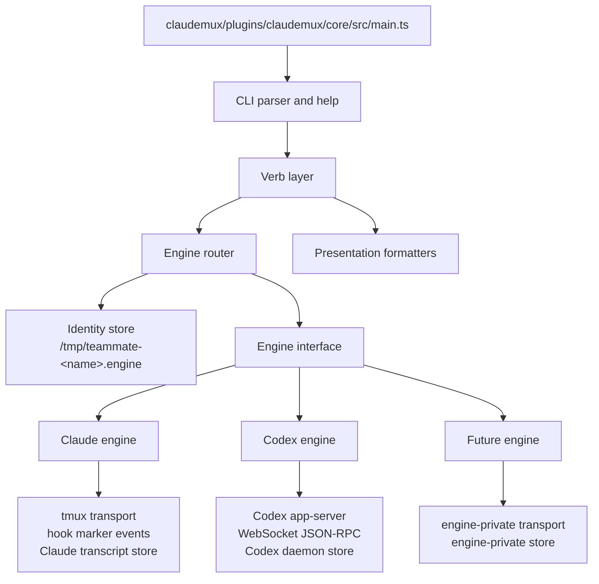

# Architecture draft: multi-engine TUI core

This draft intentionally diverges from one part of decision 0023: engine
identity should not be inferred from "which backing registry happens to
exist". The stable identity record is an explicit
`/tmp/teammate-<name>.engine` file. Liveness then belongs to the engine's own
store: tmux plus hook markers for Claude, a Codex daemon registry for Codex,
and a future engine's own process/session store. This keeps identity stable
even when the live substrate is dead, stale, or being reaped.

The other design stance is that not every noun in the desired architecture is
an interface boundary. `Engine`, `Identity`, `EventStream`, `Persistence`, and
`Verb` are real seams. `Transport` is engine-private plumbing. `Runtime` is
composition and dependency injection, not a resident service and not another
business layer.

## Shape



The CLI layer owns the names and grammar of `tm spawn`, `tm send`, `tm wait`,
`tm ctx`, `tm compact`, `tm kill`, `tm states`, `tm ls`, `tm history`,
`tm last`, `tm mem`, `tm reload`, `tm archive`, and `tm doctor`. It should not
know whether a teammate is a tmux session, a Codex daemon, or a future TUI.

The verb layer owns tm semantics: "send is atomic by default", "spawn may
atomically deliver an initial prompt", "kill is idempotent", "states is a
fleet view", and "doctor reconciles stale state". It resolves a teammate to
an engine and calls the engine through one interface. It does not parse tmux
output, open WebSockets, or read engine-specific pid files.

The engine layer owns how a TUI is driven. Claude maps a prompt to tmux input
and hook files. Codex maps a prompt to `thread/start`, `thread/resume`, and
`turn/start` over the app-server JSON-RPC connection. A future Gemini or Cursor
engine should live in one new engine directory and implement the same engine
contract.

The persistence layer owns file shapes and atomicity. It is the only place
that constructs `/tmp/teammate-*`, `/tmp/claude-idle/*`,
`/tmp/teammate-codex/*`, and `~/.claude/projects/<encoded>/...` paths.
Callers ask for path builders or stores; they do not concatenate protocol
paths by hand.

The transport layer is deliberately not a cross-engine abstraction. A tmux pane
and a WebSocket JSON-RPC connection do not have the same useful API. Each
engine owns its transport module, and tests inject that module at the engine
boundary. Shared process primitives such as "spawn and capture stdout/stderr"
remain under runtime utilities.

## Engine Interface

The engine interface should model claudemux teammate behavior, not the raw API
surface of any one TUI.

```ts
export type EngineId = 'claude' | 'codex' | 'gemini' | 'cursor' | string

export interface EngineCapabilities {
  readonly atomicSend: true
  readonly atomicSpawnPrompt: boolean
  readonly detachedTurn: 'unsupported' | 'replayable' | 'best-effort-push'
  readonly itemStream: 'none' | 'completion-only' | 'full'
  readonly compaction: 'native-command' | 'prompt-command' | 'unsupported'
  readonly contextUsage: 'transcript-jsonl' | 'rpc-token-usage' | 'unsupported'
  readonly history: 'transcript-files' | 'rpc-thread-list' | 'unsupported'
  readonly memory: 'claude-project-memory' | 'engine-native' | 'unsupported'
  readonly reload: 'prompt-command' | 'native-command' | 'unsupported'
}

export interface Engine {
  readonly id: EngineId
  readonly label: string
  readonly capabilities: EngineCapabilities

  spawn(request: SpawnRequest, ctx: EngineContext): Promise<SpawnResult>
  send(request: SendRequest, ctx: EngineContext): Promise<TurnResult>
  wait(request: WaitRequest, ctx: EngineContext): Promise<TurnResult>
  compact(request: CompactRequest, ctx: EngineContext): Promise<CompactResult>
  kill(request: KillRequest, ctx: EngineContext): Promise<KillResult>

  last(request: LastRequest, ctx: EngineContext): Promise<TextResult>
  ctx(request: ContextRequest, ctx: EngineContext): Promise<ContextResult>
  history(request: HistoryRequest, ctx: EngineContext): Promise<HistoryResult>
  mem(request: MemoryRequest, ctx: EngineContext): Promise<TextResult>
  reload(request: ReloadRequest, ctx: EngineContext): Promise<ReloadResult>
  inspect(request: InspectRequest, ctx: EngineContext): Promise<EngineSnapshot>
  doctor(ctx: EngineContext): Promise<DoctorSection>
}

export interface EngineContext {
  readonly runtime: Runtime
  readonly identity: TeammateIdentity
  readonly stores: Stores
  readonly events: EventStreamFactory
}

export interface SpawnRequest {
  readonly name: TeammateName
  readonly cwd: string | null
  readonly displayName: string | null
  readonly resumeToken: string | null
  readonly prompt: string | null
  readonly wait: boolean
  readonly engineOptions: Record<string, unknown>
}

export interface SendRequest {
  readonly name: TeammateName
  readonly prompt: string
  readonly wait: boolean
  readonly timeoutMs: number | null
}

export interface WaitRequest {
  readonly name: TeammateName
  readonly timeoutMs: number | null
  readonly fresh: boolean
}

export interface TurnResult {
  readonly name: TeammateName
  readonly engine: EngineId
  readonly status: 'completed' | 'failed' | 'timed-out' | 'unsupported'
  readonly text: string
  readonly items: readonly InteractionItem[]
  readonly context: ContextResult | null
  readonly diagnostics: readonly string[]
}
```

Every engine method returns a domain result. The verb formatter turns that into
the exact stdout, stderr, and exit code. This prevents engine modules from
becoming mini CLI implementations, and it keeps the output contract in one
place.

Unsupported capability is a normal result path, not a missing method. For
example, a Codex engine can return `contextUsage: 'rpc-token-usage'` once that
is reliable; until then `tm ctx <codex-name>` returns a clear unsupported or
unavailable result through the same verb formatter. The abstraction should not
fake a Claude-style jsonl usage number for Codex.

## Identity And Liveness

Identity is a stable fact chosen at spawn:

```ts
export interface TeammateIdentity {
  readonly name: TeammateName
  readonly engine: EngineId
  readonly createdAt: number
  readonly cwd: string | null
}

export interface IdentityStore {
  reserve(name: TeammateName, engine: EngineId): Promise<IdentityReservation>
  read(name: TeammateName): Promise<TeammateIdentity | null>
  list(): Promise<readonly TeammateIdentity[]>
  remove(name: TeammateName): Promise<void>
}

export interface IdentityReservation {
  readonly identity: TeammateIdentity
  commit(): Promise<void>
  rollback(): Promise<void>
}
```

The on-disk identity file is `/tmp/teammate-<name>.engine`, with one line:
the engine id. A companion metadata file may exist for diagnostics, but engine
routing must not require it. The engine file is written atomically during
spawn reservation and removed only by `tm kill` or `tm doctor` after a
deliberate orphan cleanup. A teammate named `codex-reviewer` can be a Claude
teammate if its engine file says `claude`.

Liveness is not identity. Claude liveness is whether the tmux session and the
current sid marker still line up. Codex liveness is whether the pid recorded
in its daemon store still answers signal 0 and its socket is usable. A future
engine may have a PTY, a Unix socket, or a server-managed conversation id. The
router reads identity first, then delegates liveness to that engine.

This rule also defines cross-engine name reuse: a name with an engine file is
taken. `tm spawn <name> --engine codex` must reject if
`/tmp/teammate-<name>.engine` already contains `claude`, even if no tmux
session is live. `tm doctor` can report and reap stale engine-specific state,
but it must not silently reinterpret the teammate as another engine.

## Event Stream

Codex and Claude do not share an event model. Codex has a push stream:
`turn/started`, `item/*`, and `turn/completed`. Claude exposes filesystem
markers written by `SessionStart`, busy hooks, and stop hooks. The shared
abstraction should be an interaction stream with capability flags, not a fake
lowest-common-denominator hook.

```ts
export type InteractionEvent =
  | { readonly kind: 'ready'; readonly name: TeammateName; readonly at: number }
  | { readonly kind: 'turn.started'; readonly name: TeammateName; readonly turnId: string; readonly at: number }
  | { readonly kind: 'item.completed'; readonly name: TeammateName; readonly turnId: string; readonly item: InteractionItem; readonly at: number }
  | { readonly kind: 'turn.completed'; readonly name: TeammateName; readonly turnId: string; readonly text: string; readonly at: number }
  | { readonly kind: 'turn.failed'; readonly name: TeammateName; readonly turnId: string | null; readonly message: string; readonly at: number }

export interface EventStream {
  readonly capabilities: {
    readonly push: boolean
    readonly replay: boolean
    readonly itemCompleteness: 'none' | 'partial' | 'full'
  }
  waitForTurn(request: WaitForTurnRequest): Promise<TurnResult>
  close(): Promise<void>
}
```

For Codex, the stream subscribes before `turn/start`, accumulates
`item/completed`, and resolves on `turn/completed`. It should not trust
`turn.completed.turn.items`, because the app-server intentionally sends an
empty `items` array with `itemsView: "notLoaded"` for live notifications.

For Claude, the stream is synthesized: `ready` comes from the ready marker,
`turn.completed` comes from the idle marker plus `<sid>.last`, and item
completeness is `none`. This is not a defect in the abstraction; it is the
truth of the engine.

Detached turns should be capability-gated. Codex's current "send with
`--no-wait`, close the WebSocket, later `wait`" shape is not replay-safe
because the daemon only pushes to subscribed connections. Unless an engine can
replay turn completion from durable history or hold a subscription outside the
short-lived `tm` process, `detachedTurn` should be `unsupported`. Atomic
`tm send <name> --prompt ...` and `tm spawn <name> --engine codex --prompt ...`
remain mandatory and use one engine operation from subscribe to completion.

## Persistence

Persistence is split by ownership:

| Store | Owner | Used for |
|---|---|---|
| `/tmp/teammate-<name>.engine` | `IdentityStore` | Stable engine routing |
| `/tmp/teammate-<name>.sid` | Claude engine | Current Claude session id |
| `/tmp/teammate-<name>.cwd` | Claude engine and SessionStart hook | Claude identity gate |
| `/tmp/teammate-<name>.ready` | Claude SessionStart hook | Spawn readiness |
| `/tmp/teammate-<name>.send-at` | Claude engine | Pane quiet timing |
| `/tmp/claude-idle/<sid>` | Claude hooks | Turn completion marker |
| `/tmp/claude-idle/<sid>.busy` | Claude hooks | Busy marker |
| `/tmp/claude-idle/<sid>.last` | Claude hooks | Last text reply |
| `/tmp/teammate-codex/<name>/pid` | Codex engine | Daemon process id |
| `/tmp/teammate-codex/<name>/socket` | Codex engine | App-server Unix socket |
| `/tmp/teammate-codex/<name>/thread` | Codex engine | Current thread id |
| `/tmp/teammate-codex/<name>/started-at` | Codex engine | Diagnostics |
| `/tmp/teammate-codex/<name>/last-seen` | Codex engine | Diagnostics and doctor |
| `/tmp/teammate-codex/<name>/meta.json` | Codex engine | Spawn options |
| `~/.claude/projects/<encoded>/...` | Claude Code | Claude history, ctx, memory |

All paths above should be built by named functions under persistence modules.
The current `claudemux/plugins/claudemux/core/src/paths.ts` mixes Claude hook
paths, Codex daemon paths, and project-dir encoding in one file; the better
shape keeps the path-builder rule but splits it by store owner.

The `ctx` limitation after compaction should stay a verb-output policy, not a
deep persistence rewrite. If a context source is known unreliable for the last
operation, the verb formatter omits the numeric `ctx:` line or marks it
unavailable. The abstraction should not patch append-only jsonl semantics.

## Source Tree

The core should stop using one `native.ts` as the place where every behavior
lands. The proposed hand-authored tree is file-level and engine-extensible:

```text
claudemux/plugins/claudemux/core/src/
  main.ts                         process entrypoint; argv/stdin to CLI result
  cli/dispatch.ts                 top-level CLI routing and help pre-scan
  cli/help.ts                     user-facing help strings for every verb
  cli/result.ts                   TmResult, exit-code helpers, stream joining
  cli/spawn-options.ts            shared parsing for --engine and spawn flags
  runtime/runtime.ts              Runtime interface passed to verbs and engines
  runtime/production.ts           production wiring for fs, process, tmux, clock
  runtime/clock.ts                injectable wall-clock and sleep helpers
  runtime/process-runner.ts       spawn/capture primitive; no shell parsing
  runtime/env.ts                  env-var readers with validation
  persistence/atomic-file.ts      atomic write, read-if-present, mkdir helpers
  persistence/paths.ts            root path constants and shared validation
  persistence/identity-store.ts   /tmp/teammate-<name>.engine read/write/list
  persistence/claude-paths.ts     Claude /tmp marker and ~/.claude path builders
  persistence/codex-paths.ts      Codex daemon registry path builders
  persistence/project-dir.ts      Claude project-dir encoding source of truth
  identity/name.ts                teammate-name parser and validation
  identity/engine-id.ts           EngineId union and known-engine registry keys
  identity/router.ts              resolve name to engine through IdentityStore
  events/interaction-event.ts     normalized InteractionEvent and InteractionItem
  events/event-stream.ts          EventStream and EventStreamFactory contracts
  events/turn-result.ts           TurnResult, ContextResult, HistoryResult types
  engines/engine.ts               Engine interface and request/result types
  engines/capabilities.ts         EngineCapabilities and unsupported helpers
  engines/registry.ts             maps EngineId to Engine implementation
  engines/claude/claude-engine.ts     Claude Engine implementation
  engines/claude/claude-spawn.ts      tmux new-session plus SessionStart readiness
  engines/claude/claude-send.ts       tmux prompt delivery and atomic wait
  engines/claude/claude-wait.ts       idle-marker and pane-quiet wait logic
  engines/claude/claude-compact.ts    /compact command and refusal detection
  engines/claude/claude-liveness.ts   tmux session and sid-marker inspection
  engines/claude/claude-history.ts    jsonl history listing and detail parsing
  engines/claude/claude-context.ts    jsonl usage extraction for tm ctx
  engines/claude/claude-memory.ts     ~/.claude project memory reader
  engines/claude/claude-events.ts     synthesized EventStream from hook markers
  engines/claude/tmux-transport.ts    tmux command adapter for Claude only
  engines/codex/codex-engine.ts       Codex Engine implementation
  engines/codex/codex-supervisor.ts   daemon spawn, liveness, reap
  engines/codex/codex-json-rpc.ts     JSON-RPC envelope client over WebSocket
  engines/codex/codex-transport.ts    Unix-socket WebSocket connection builder
  engines/codex/codex-threads.ts      thread start/resume/read helpers
  engines/codex/codex-turns.ts        turn/start, wait, interrupt helpers
  engines/codex/codex-events.ts       Codex EventStream over app-server notifications
  engines/codex/codex-turn-collector.ts item accumulation for live turns
  engines/codex/codex-doctor.ts       Codex doctor section and orphan cleanup
  engines/codex/protocol/index.ts     generated app-server protocol barrel
  verbs/index.ts                  public verb registry
  verbs/spawn.ts                  parse tm spawn and call selected engine
  verbs/send.ts                   parse tm send and call identity-selected engine
  verbs/wait.ts                   parse tm wait and call identity-selected engine
  verbs/compact.ts                parse tm compact and call selected engine
  verbs/kill.ts                   parse tm kill and remove identity on success
  verbs/states.ts                 fleet state view from identity plus engine inspect
  verbs/ls.ts                     fleet list view from identity plus engine inspect
  verbs/history.ts                history verb formatter and engine delegation
  verbs/last.ts                   last-turn formatter and engine delegation
  verbs/ctx.ts                    context formatter and reliability policy
  verbs/mem.ts                    memory formatter and engine delegation
  verbs/reload.ts                 reload fan-out through Engine.reload
  verbs/archive.ts                dispatcher task archive verb
  verbs/doctor.ts                 global checks plus engine doctor sections
  verbs/status.ts                 diagnostic pane/screen capture when retained
  verbs/poll.ts                   diagnostic pattern wait when retained
  verbs/resume.ts                 resume alias/compat surface when retained
  verbs/ask.ts                    optional Codex pool reviewer if retained
  presentation/table.ts           table alignment without leaking column calls
  presentation/format-turn.ts     stdout/stderr rendering for TurnResult
  presentation/format-state.ts    ls/states/doctor formatting
  presentation/format-history.ts  history detail and list formatting
  support/column.ts               optional column binary adapter
  support/grep.ts                 optional grep binary adapter
  support/tm-binary.ts            resolve installed tm for integration harnesses
```

`claudemux/plugins/claudemux/core/src/engines/codex/protocol/` is generated
from `codex app-server generate-ts --experimental`. Its leaf files are not
hand-authored architecture surfaces; every file in that directory is an
upstream app-server type binding and should be regenerated, not edited. The
only hand-authored file that imports it directly is the Codex engine family,
starting at `claudemux/plugins/claudemux/core/src/engines/codex/codex-json-rpc.ts`
and `claudemux/plugins/claudemux/core/src/engines/codex/codex-threads.ts`.

The production shell launcher remains
`claudemux/plugins/claudemux/bin/tm`. It should stay a shim that resolves the
bundled Node entrypoint and `exec`s Node. It should not regain verb parsing or
engine routing.

## Verb Responsibilities

`tm spawn <name> --engine claude|codex` is the only place where a user selects
an engine. The spawn verb validates the engine id, reserves identity, calls
`engine.spawn`, and commits or rolls back the reservation. Every later
teammate-targeted verb resolves the engine from `/tmp/teammate-<name>.engine`.

`tm send` and `tm spawn --prompt` are atomic by default. Atomic means one
engine operation owns the prompt delivery, completion wait, result extraction,
and context diagnostic decision. For Codex, that is one WebSocket connection
that subscribes before `turn/start` and closes only after `turn/completed`.
For Claude, that is tmux delivery followed by hook-marker wait and last-file
read.

`tm wait` waits using the engine's own completion source. It is not a generic
poller over `/tmp`. For engines without replay-safe detached turns, `tm wait`
should only support waits that can be made truthful. A false "waited" result
is worse than an unsupported one.

`tm ls` and `tm states` list identities first, then ask each engine for an
inspection snapshot. This avoids today's split where Claude teammates are
enumerated from tmux and Codex teammates from a separate doctor-only registry.
A dead teammate with an engine file still appears as stale until `tm kill` or
`tm doctor` removes it.

`tm doctor` is the reconciliation surface. It can report missing binaries,
stale identity files, orphaned Codex daemons, tmux sessions without identity,
and engine-specific repair hints. It should not silently change engine identity
or infer engines from names.

## Adding A Third Engine

Adding `gemini` or `cursor` should require:

- one new directory under `claudemux/plugins/claudemux/core/src/engines/<engine>/`
  with `<engine>-engine.ts`, transport, event, liveness, and persistence files;
- one `EngineId` entry in
  `claudemux/plugins/claudemux/core/src/identity/engine-id.ts`;
- one registration in
  `claudemux/plugins/claudemux/core/src/engines/registry.ts`;
- help text that lists the new value for `tm spawn <name> --engine <engine>`.

It should not require new verb files, new CLI grammar outside `spawn`, a new
name prefix, or changes to Claude and Codex internals.

The only acceptable reason to touch a verb for a new engine is if the public
verb contract itself changes for every engine. Engine-specific flags belong in
`SpawnRequest.engineOptions` and engine-specific validation, not in a new
parallel CLI surface.

## Boundaries

The CLI does not know transports. It sees argv, help, and `TmResult`.

The verb layer does not know tmux, WebSocket, Codex app-server method names,
Claude hook filenames, or Codex pid filenames. It knows identity, capability,
engine calls, and presentation.

The engine router does not know liveness. It maps a teammate name to an engine
from the identity store and hands control to the registered engine.

An engine implementation does not know CLI grammar. It receives structured
requests and returns structured results.

Transport modules do not know verbs. They connect, send frames or key
sequences, and report low-level outcomes to their engine.

Persistence modules do not make business decisions. They build paths and
perform atomic reads/writes for their owning store.

Runtime does not hold state between invocations. It wires dependencies for one
`tm` process and then exits.
