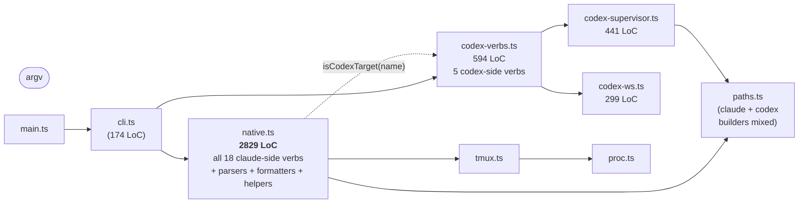
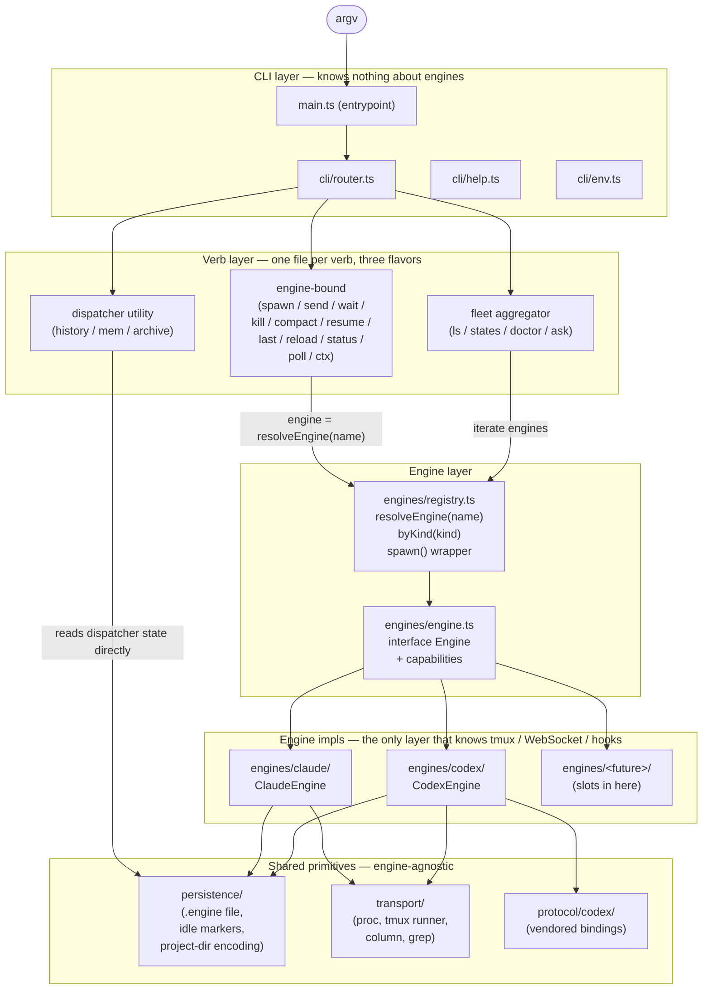
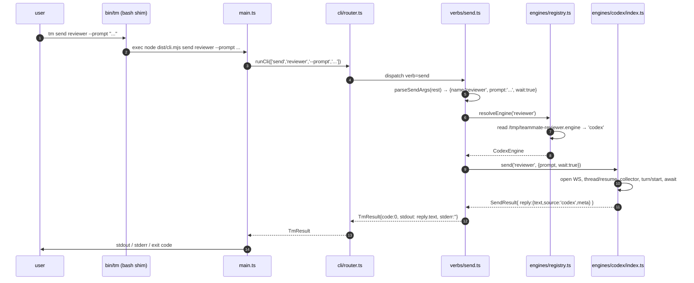
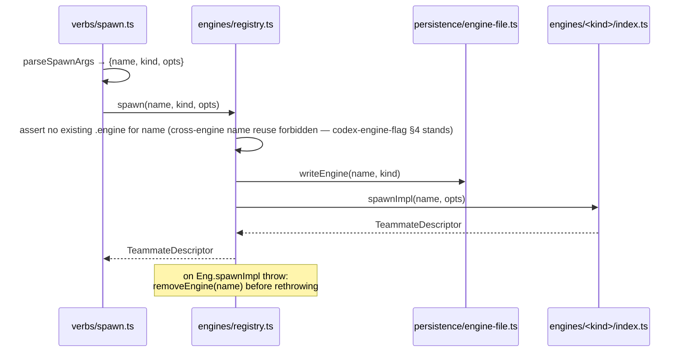
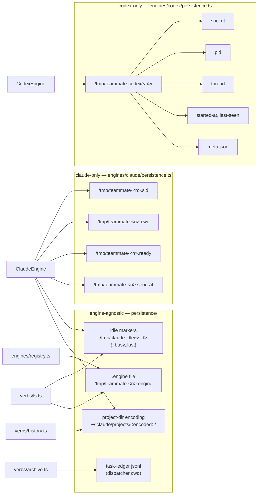

# Multi-engine `tm` architecture (claude-side draft)

> **Status — Archived input draft.** One of the two parallel drafts cross-read
> into [decision multi-engine-tui-architecture](/.agents/decisions/multi-engine-tui-architecture.md),
> which is the authoritative converged record. Kept for provenance; not
> maintained, and superseded by that decision wherever the two differ.

A target shape for `claudemux/plugins/claudemux/` once `tm` is no
longer a single monoblob. This draft answers the user's brief: where
the seams should live, what the directory tree should look like to its
last file, and what shape `Engine` must hold so a third or fourth TUI
slots in without reopening any layer above it.

This is the **claude-side draft**. A parallel **codex-side draft** is
being written independently; neither author reads the other before
both ship.

## Position statements (the load-bearing calls; push back here first)

Two calls in this draft override prior recorded decisions or take a
deliberate fork in the design space. Both are surfaced up front so a
cross-reader does not have to mine them out of the body.

**Position A — Engine identity is an explicit `.engine` file, not
inferred from registry-directory presence.**
[Decision codex-engine-flag](/.agents/decisions/codex-engine-flag.md) §2 chose
to derive engine identity from "which of the two existing registries
holds the name" (the Claude side's `/tmp/teammate-<n>.{sid,cwd,ready}`
versus the codex side's `/tmp/teammate-codex/<n>/`). This draft
**supersedes codex-engine-flag §2** with a single-source-of-truth file
`/tmp/teammate-<n>.engine` written atomically by `Engine.spawn` and
removed by `Engine.kill`. The inference-from-registry shape works for
two engines whose persistence happens to be disjoint; the third engine
breaks it the moment it wants to write a `.cwd` for diagnostic
reasons, or wants to share the per-sid idle marker dir with claude.
The user's brief explicitly names this file (`#5`), and the brief also
authorises dropping the one-minor deprecation window codex-engine-flag baked in
(`#6` — "0.8.x 是本地未发布,清断"). Net effect: codex-engine-flag lands as
*Superseded by multi-engine-tui-architecture* when multi-engine-tui-architecture lands; its §1 (`--engine` flag at spawn)
and §4 (cross-engine name reuse forbidden) carry forward, §2 and §3
do not.

**Position B — No unified `InteractionEvent` stream. `Engine.wait()`
returns `Promise<TurnReply>`; how each engine watches for "turn
ended" is the engine's secret.**
Codex emits a push-stream (`item/completed` + `turn/completed` over
the daemon's WebSocket); claude marks turn completion by the
`Stop`-hook touching `/tmp/claude-idle/<sid>` and writing
`/tmp/claude-idle/<sid>.last`. These two event models are not
isomorphic: codex's stream carries structured `ThreadItem` payloads
that claude has nothing equivalent to, and claude's idle marker is a
plain filesystem signal that the codex daemon does not produce.
Faking a `unified-event` abstraction over both will leak — either we
shrink the contract until it carries no codex-specific richness (and
the codex driver pays an integration tax for nothing), or we widen it
with an `unknown` payload and the abstraction is in name only. The
brief flags this in *Key cognitive inputs* and offers the explicit
fork (`EngineCapability` routing); this draft takes that fork. A
future verb that *does* want streaming progress (a live `tm tail`,
telemetry) earns a separate **capability** on `Engine`
(`Engine.events?(name): AsyncIterable<InteractionEvent>`) added at the
moment the verb is, not pre-built against speculation.

If a cross-reader disagrees, A and B are the leverage points — the
verb layer and the directory tree below follow from these. The
remaining choices below are subordinate to them.

## What's broken about the present shape



The shape that broke down:

| | What's there now | Cost |
|---|---|---|
| **Top-level src/ is flat** | 16 sibling files. The reader has no map for which file owns which concern. | Adding the third engine means picking *where* its files go among the flat siblings, with no precedent. The implementer chooses the precedent every time. |
| **`native.ts` holds 18 verbs as siblings of 50 helpers** | Verb impls inline alongside parsers, formatters, and miscellany — 2829 lines, one file. | The user's exact complaint: "2400 行 native.ts". A bug in `tm send` makes you scroll past `tm history`'s helpers. |
| **Verb-level engine fork in 4 places** | `isCodexTarget(repo)` at native.ts:1149 (kill), :2051 (spawn), :2310 (send), :2445 (wait). | Each verb head re-decides the engine. A bug fix has to land at the right one of four near-identical sites. |
| **Two parallel verb trees** | Claude-side verbs in `native.ts`, codex-side in `codex-verbs.ts`. No shared interface. | The next engine forks a third tree. By the fourth engine you have N×M files where M is the verb set. |
| **Path builders mixed by engine** | `paths.ts` carries `idleDir / sidFile / cwdFile / encodeProjectDir` (claude) **and** `codexRegistryRoot / codexSocketPath / codexThreadFile` (codex) side by side. | Engine ownership of state is invisible — the reader has to know which builder is for which side. |
| **`verbs.ts` is stale** | Documents the "MCP tool" surface from a superseded decision (mcp-native-orchestration-core). | Misleads; no current verb dispatch reads it. |

The fix is not "split `native.ts` into smaller files of the same shape"
(that just makes the next-shape decision later). It's to introduce the
abstraction the existing code-shape is silently doing by hand — the
**Engine**.

## Target architecture



The cut by-row is:

| Layer | Knows about | Does not know about |
|---|---|---|
| CLI | argv, exit codes, help text | engines, transports, state |
| Verb | the user contract for one verb | which engine is selected (asks the registry), how that engine talks |
| Engine registry | the set of engines, the `.engine` file | how any engine actually executes a turn |
| Engine impl | one engine's transport, persistence shape, semantics | other engines, other verbs |
| Persistence / transport | byte-level paths, process spawning, tmux/WS plumbing | verbs, engines (transport is consumed by impls) |

Above the registry, code only sees `Engine`. Below it, code only sees
one engine. **No layer above the engine impl says the word "tmux" or
"codex".**

## Target directory tree, to its last file

```text
claudemux/plugins/claudemux/
├── bin/
│   └── tm                                   # dev launcher, runs main.ts under tsx (unchanged from today)
├── package.json
├── tsconfig.json
├── README.md                                # build / test instructions (unchanged)
├── dist/
│   └── cli.mjs                              # esbuild output (committed bundle, decision node-cli-committed-bundle)
├── src/
│   ├── main.ts                              # process entrypoint: argv → router → exit code; reads stdin only for archive
│   ├── cli/
│   │   ├── router.ts                        # runCli(argv, env, stdin?) — current cli.ts, no change in shape
│   │   ├── result.ts                        # TmResult, TmRunOptions (current tm.ts split)
│   │   ├── env.ts                           # NativeEnv interface + productionEnv() factory
│   │   └── help.ts                          # HELP_TEXTS, OVERVIEW_HELP, REMOVED_VERB_MESSAGES (current help.ts)
│   ├── verbs/
│   │   ├── catalog.ts                       # the verb registry: { name → handler, registry-effect }
│   │   ├── spawn.ts                         # parse flags, resolve engine kind, call EngineRegistry.spawn
│   │   ├── send.ts                          # resolve engine from name, delegate to engine.send
│   │   ├── wait.ts                          # resolve, delegate to engine.wait
│   │   ├── kill.ts                          # resolve, delegate to engine.kill
│   │   ├── compact.ts                       # require capability, delegate
│   │   ├── resume.ts                        # require capability, delegate
│   │   ├── last.ts                          # resolve, delegate
│   │   ├── reload.ts                        # broadcast over claude engine (the only one that exposes the capability today)
│   │   ├── ctx.ts                           # require capability, delegate; verb layer never prints a ctx number for an engine that lacks it
│   │   ├── status.ts                        # pane-capture diagnostic — claude-only capability
│   │   ├── poll.ts                          # pane-match diagnostic — claude-only capability
│   │   ├── ls.ts                            # fleet aggregator: enumerate teammates across all engines, list one row each
│   │   ├── states.ts                        # fleet aggregator: per-teammate one-line snapshot (engine, ctx, age, last preview)
│   │   ├── doctor.ts                        # fleet aggregator: env / tmux / idle-dir / per-engine self-check
│   │   ├── ask.ts                           # engine-bound to engines that expose AskPool capability (codex today)
│   │   ├── history.ts                       # dispatcher utility: read ~/.claude/projects/ — never touches Engine
│   │   ├── mem.ts                           # dispatcher utility: read sibling repo's auto-memory dir
│   │   └── archive.ts                       # dispatcher utility: task-ledger jsonl rewrite
│   ├── engines/
│   │   ├── kind.ts                          # type EngineKind = 'claude' | 'codex'; KNOWN_KINDS: readonly EngineKind[]
│   │   ├── engine.ts                        # interface Engine + interface AskPool + capability discriminants + all data types (SpawnOptions, SendOptions, WaitOptions, TurnReply, TeammateDescriptor, FleetSnapshot, …)
│   │   ├── registry.ts                      # resolveEngine(name): Engine | null; byKind(kind): Engine; allEngines(): Engine[]; spawn(name, kind, opts) — the wrapper that writes .engine, then delegates to engine.spawnImpl
│   │   ├── claude/
│   │   │   ├── index.ts                     # ClaudeEngine: Engine — methods are thin facades, real work in the per-op files
│   │   │   ├── spawn.ts                     # tmux session create, env identity gate, pollReady (raised budget per phase-1-bug-audit B)
│   │   │   ├── send.ts                      # paste-buffer round trip, send-at touch, optional ctx echo
│   │   │   ├── wait.ts                      # idleMarker poll + busyMarker poll; returns TurnReply built from <sid>.last
│   │   │   ├── kill.ts                      # tmux kill-session, marker cleanup
│   │   │   ├── compact.ts                   # /compact REPL flow + verify (jsonl scan)
│   │   │   ├── resume.ts                    # /resume by sid, jsonl history walk
│   │   │   ├── reload.ts                    # /reload-plugins broadcast
│   │   │   ├── ctx.ts                       # jsonl-driven context-window accounting
│   │   │   ├── last.ts                      # read <sid>.last + format
│   │   │   ├── pane.ts                      # capture-pane wrappers (status, poll verbs)
│   │   │   ├── persistence.ts               # builders for .sid / .cwd / .ready / .send-at, plus readers; calls writeEngine on spawn / removeEngine on kill via the registry wrapper
│   │   │   └── repo-lookup.ts               # projectDirForRepo, dispatcher-sibling resolution
│   │   └── codex/
│   │       ├── index.ts                     # CodexEngine: Engine — facade over the per-op files
│   │       ├── spawn.ts                     # daemon spawn, registry dir create, meta.json write
│   │       ├── send.ts                      # turn/start over WS, optional collector for atomic round trip
│   │       ├── wait.ts                      # thread/resume + subscribeTurnCollection; bug-fix from PR #47 lives here
│   │       ├── kill.ts                      # reapDaemon (signal the process group, then rm -rf)
│   │       ├── ask.ts                       # borrow / release a daemon thread for the ask pool
│   │       ├── supervisor.ts                # spawnDaemon / reapDaemon / readDaemonState (current codex-supervisor.ts, unchanged in shape)
│   │       ├── ws.ts                        # CodexWsClient (current codex-ws.ts, unchanged in shape)
│   │       ├── turn-collector.ts            # subscribeTurnCollection — the item-stream → TurnReply assembly
│   │       └── persistence.ts               # builders for codex registry, plus the ones the verb fixes added
│   ├── persistence/
│   │   ├── engine-file.ts                   # readEngine(name): EngineKind | null; writeEngine(name, kind); removeEngine(name) — Position A's load-bearing module
│   │   ├── idle-markers.ts                  # idleDir, idleMarkerFor, busyMarkerFor, lastFileFor — claude-engine consumers, but lives here because fleet aggregators read these too (the ledger doesn't care which engine wrote them)
│   │   ├── project-dir.ts                   # encodeProjectDir + repo-to-project-dir helpers — the Claude Code on-disk convention (decision cross-process-cross-platform-invariants's "one source of truth")
│   │   └── task-ledger.ts                   # archive verb's jsonl reader/writer (engine-agnostic)
│   ├── transport/
│   │   ├── proc.ts                          # spawnCapture, the one process primitive (current proc.ts)
│   │   ├── tmux.ts                          # TmuxRunner type + runTmux (current tmux.ts)
│   │   ├── column.ts                        # column shell-out (current column.ts)
│   │   └── grep.ts                          # grep shell-out (current grep.ts)
│   ├── protocol/
│   │   └── codex/                           # current codex-protocol/ — vendored TS bindings, byte-for-byte the schema codex emits
│   └── shared/
│       ├── time.ts                          # nowSec(), sleep(ms), fmtLocalDateTime — shared formatters
│       ├── result.ts                        # die(message): TmResult helper; common error builders
│       └── parse.ts                         # shared CLI flag parsers (the parseSpawnArgs / parseSendArgs family); each verb still owns its own parser, but the building blocks (bool-flag, value-flag, --) live here
└── test/
    ├── conformance.test.ts                  # behavior parity vs goldens (unchanged in spirit)
    ├── cli.test.ts                          # router-level tests (unchanged)
    ├── goldens/                             # unchanged
    ├── fixtures/                            # unchanged
    ├── integration/                         # live-teammate suite (unchanged)
    ├── engines/
    │   ├── engine.contract.test.ts          # the Engine interface as a test fixture: every concrete engine must pass the same spawn → send → wait → kill round trip on a fake transport
    │   ├── claude.test.ts                   # ClaudeEngine specifics (paste-buffer formatting, idle-marker semantics)
    │   └── codex.test.ts                    # CodexEngine specifics (subsumes codex-verbs.test.ts, codex-supervisor.test.ts, codex-ws.test.ts, codex-schema.test.ts of today)
    ├── persistence/
    │   ├── engine-file.test.ts              # .engine file invariants
    │   ├── idle-markers.test.ts
    │   └── project-dir.test.ts              # encodeProjectDir (current paths.test.ts content)
    └── transport/
        └── proc.test.ts                     # spawnCapture (current proc.test.ts)
```

What collapses, what moves, what is new:

| Today | Tomorrow | Why |
|---|---|---|
| `native.ts` (2829 LoC, 18 verbs + 50 helpers) | `verbs/*.ts` (18 files) + `engines/claude/*.ts` | One file per concern; the verb layer holds CLI-shape, the claude engine holds claude-flavored turn mechanics. |
| `codex-verbs.ts` (594 LoC) | `verbs/{spawn,send,wait,kill,ask}.ts` (the engine-bound part) + `engines/codex/*.ts` (the codex-flavored part) | The current file is "codex-flavored verbs". Tomorrow the verb layer is engine-agnostic and the codex flavor lives in `engines/codex/`. |
| `codex-supervisor.ts`, `codex-ws.ts` | `engines/codex/{supervisor,ws,turn-collector}.ts` | Same code, ownership made explicit. |
| `paths.ts` (claude + codex mixed) | `persistence/{engine-file,idle-markers,project-dir,task-ledger}.ts` (engine-agnostic) + `engines/<eng>/persistence.ts` (engine-specific) | A reader who wants to see "what files does the codex engine touch" reads one place. |
| `verbs.ts` (stale mcp-native-orchestration-core MCP-tool catalog) | deleted | Superseded by node-cli-orchestrator; no current code reads it. |
| `tm.ts` (`TmResult` + `resolveTmBinary`) | `cli/result.ts` + integration harness keeps `resolveTmBinary` near its consumer | `resolveTmBinary` is only used by the live-teammate suite — let it live next to the test that owns it. |
| `isCodexTarget` (5 call sites, predicate) | deleted; replaced by `resolveEngine(name)` reading `/tmp/teammate-<n>.engine` (Position A) | The forks vanish; the verb layer just calls `resolveEngine(name).send(...)`. |

What does **not** move:

- `bin/tm` (Bash launcher) — its job is "find dist/cli.mjs and exec node". Engine plurality does not touch it.
- `dist/cli.mjs` — committed bundle stays committed (decision node-cli-committed-bundle).
- `protocol/codex/` — the vendored TS bindings are a frozen contract; they keep their tree shape and get re-generated by `codex app-server generate-ts` exactly as today.
- The Claude-side hooks (`hooks/on-session-start.sh`, `hooks/on-stop.sh`, `hooks/on-busy.sh`) — they remain the source of the `.ready` / `.busy` / `<sid>.last` / `_on-stop.log` writes. The Engine abstraction lives **inside** the Node core; the hooks are upstream of it and continue to write the files the `ClaudeEngine` reads.

## The Engine interface

The exact shape, in pseudo-TS — every signature load-bearing, no
optional fields that "might be useful later":

```ts
// engines/kind.ts
export type EngineKind = 'claude' | 'codex'
export const KNOWN_KINDS: readonly EngineKind[] = ['claude', 'codex']

// engines/engine.ts
export interface Engine {
  /** The engine's identity. */
  readonly kind: EngineKind

  // ───── Required: every engine implements these ─────

  /**
   * Bring a new teammate into existence. The caller (registry wrapper)
   * writes the `.engine` file *before* this fires and removes it on
   * failure, so an engine impl never sees identity bookkeeping.
   *
   * Returns the descriptor for the just-spawned teammate. Throws on
   * any non-recoverable failure.
   */
  spawnImpl(name: string, opts: SpawnOptions): Promise<TeammateDescriptor>

  /**
   * Tear a teammate down. The registry wrapper removes the `.engine`
   * file *after* this returns. Idempotent: removing a teammate that
   * already exited is not an error.
   */
  killImpl(name: string): Promise<void>

  /**
   * Drive one turn end-to-end. `wait: true` resolves when the turn
   * completes and the reply is loaded; `wait: false` resolves as soon
   * as the request is in flight.
   *
   * Engine-specific failure modes (codex daemon dead, claude REPL
   * unresponsive, …) surface as exceptions. Recoverable conditions
   * (empty prompt, no such teammate) are the verb layer's business
   * and never reach here.
   */
  send(name: string, opts: SendOptions): Promise<SendResult>

  /**
   * Block until the next turn completes for `name` and return the
   * reply. The shape returned is engine-agnostic; how the engine
   * detects completion (codex notification stream, claude idle-marker
   * file appearing) is hidden.
   *
   * `Engine.events()` (capability below) is the streaming counterpart
   * if a future verb ever wants per-item progress; `wait()` is the
   * one-shot terminal answer.
   */
  wait(name: string, opts: WaitOptions): Promise<TurnReply>

  /** True if the teammate is currently up and reachable. Read-only. */
  isAlive(name: string): boolean

  /** One-line snapshot for `tm states` / `tm ls`. Cheap; no RPC. */
  describe(name: string): TeammateDescriptor

  /** Enumerate every teammate this engine owns (reads its own persistence). */
  listOwned(): readonly string[]

  // ───── Optional capabilities — present iff the engine supports them ─────

  /** Print or read the teammate's last assistant turn. */
  last?(name: string): Promise<TurnReply | null>

  /** Run /compact (or the engine's equivalent) and verify completion. */
  compact?(name: string): Promise<void>

  /** Resume a prior conversation by transcript id. Claude-flavored today. */
  resume?(name: string, opts: ResumeOptions): Promise<void>

  /** Fan out a refresh of the engine's plugin/tool surface. Claude-only. */
  reload?(name: string): Promise<void>

  /** Real context-window usage. Engines that don't track this omit it; the verb layer prints "n/a" rather than guessing. */
  ctxUsage?(name: string): Promise<CtxUsage>

  /** Pane-capture diagnostic. Claude-only (no codex daemon equivalent). */
  paneCapture?(name: string): Promise<string>

  /** Pane-match poll diagnostic. Claude-only. */
  panePoll?(name: string, pattern: RegExp, timeoutMs: number): Promise<boolean>

  /** Ask-mode pool — borrow / return a fresh thread. Codex-only today. */
  askPool?(): AskPool

  /** Streaming per-turn events, for a future `tm tail`. Absent until a verb needs it. */
  events?(name: string): AsyncIterable<InteractionEvent>
}

// engines/engine.ts (continued — value types)
export interface SpawnOptions {
  /** Working directory the teammate will operate against. */
  cwd: string
  /** A first prompt to deliver atomically with spawn, if any. */
  bootstrapPrompt?: string
  /** Engine-specific knobs (model, reasoning effort, sandbox mode, …). */
  engineOptions?: Record<string, unknown>
}

export interface SendOptions {
  prompt: string
  /** When true, the call resolves only after the turn completes (atomic round-trip). */
  wait: boolean
  /** Optional reply-collection budget when `wait: true`. */
  timeoutMs?: number
}

export interface SendResult {
  /** When `wait: false`, the reply field is null. */
  reply: TurnReply | null
}

export interface WaitOptions {
  timeoutMs?: number
}

export interface TurnReply {
  /** The assistant's text. Always populated. */
  text: string
  /** Engine that produced it — diagnostic; the verb layer rarely branches on this. */
  source: EngineKind
  /** Engine-specific structured detail (codex ThreadItem[], claude usage record, …). Verb layer treats as opaque. */
  meta?: unknown
}

export interface TeammateDescriptor {
  name: string
  kind: EngineKind
  cwd: string
  /** ISO-8601; the engine's authoritative start time. */
  startedAt: string
  /** Engine-defined liveness verdict. */
  alive: boolean
}

export interface CtxUsage {
  /** Tokens consumed; null when the engine can compute but currently has no data. */
  used: number | null
  /** Tokens available in the window. */
  window: number
}

export interface ResumeOptions {
  /** Transcript or thread id to resume against. */
  target: string
}

export interface AskPool {
  /** Borrow an idle teammate, run one turn, return it. */
  ask(prompt: string): Promise<TurnReply>
  /** Names currently in the pool — diagnostic. */
  list(): readonly string[]
}

export interface InteractionEvent {
  /** Discriminant; the verb consuming the stream switches on this. */
  kind: 'item' | 'turn-completed' | string
  payload: unknown
}
```

```ts
// engines/registry.ts
export interface EngineRegistry {
  /**
   * Resolve a teammate name to its engine via the `.engine` file.
   * Position A — the only authoritative read of engine identity.
   */
  resolve(name: string): Engine | null
  byKind(kind: EngineKind): Engine
  all(): readonly Engine[]

  /**
   * Atomic spawn wrapper: writes the .engine file, delegates to
   * engine.spawnImpl, removes the .engine file on failure. Every
   * `tm spawn` invocation flows through this — engines do not write
   * the .engine file themselves, which is what makes inter-engine
   * identity guarantees mechanical rather than a convention.
   */
  spawn(name: string, kind: EngineKind, opts: SpawnOptions): Promise<TeammateDescriptor>

  /**
   * Atomic kill wrapper: delegates to engine.killImpl, then removes
   * the .engine file.
   */
  kill(name: string): Promise<void>
}
```

Why these specific decisions, in one line each:

- **`spawnImpl` / `killImpl` are different names from `spawn` / `kill`** — the registry wrapper is the only `spawn` / `kill` callers see; the suffix is the type system telling future implementers "go through the wrapper, never call the impl directly".
- **`isAlive` is sync, `describe` is sync, `listOwned` is sync** — they read filesystem state (cheap), not network. Verbs aggregate these in tight loops (`tm states` over 10 teammates); making them async means async fan-out for no real wait.
- **`send` returns `SendResult` even when `wait: false`** — same return type whether the caller wants the atomic round trip or fire-and-forget; the variation lives inside the result.
- **`compact / resume / reload / ctxUsage / paneCapture / panePoll / askPool` are `?` optional** — capability not protocol. The verb that needs them performs a presence check at its head; engines that lack the capability fail at the verb boundary with a friendly message, not at runtime.
- **`events?()` is the future-proof seam for streaming** (Position B, codified) — not present in any engine today; added by the verb that introduces streaming consumption.
- **No `name` on `Engine`** — `Engine` is keyed by `kind`; identity is the teammate's, lived in the `.engine` file. An `Engine` is a singleton per kind.

## Verb dispatch in one diagram



What the diagram shows, said in words: there is exactly one place that
maps a name to an engine (`Reg.resolveEngine`), and exactly one place
that talks to codex (`Eng`). Above the verb file no code is engine-aware.
Inside the verb file the engine is opaque (`Engine`). Inside the engine,
all the codex-specific detail.

`tm spawn` is the one verb where the engine is named by flag rather
than resolved by lookup — the resolution doesn't apply yet, because the
teammate doesn't exist. The flow is:



Symmetric for `tm kill`: engine resolved first, `killImpl` runs, then
the `.engine` file is removed.

## How a third engine slots in

A `gemini` engine arrives. Concretely:

1. Add `gemini` to `engines/kind.ts`'s `EngineKind` union and `KNOWN_KINDS` array. *One line, one place.*
2. Create `engines/gemini/` mirroring `engines/codex/`'s shape: `index.ts` exposing a `GeminiEngine: Engine`, plus whatever per-op files the engine's persistence / transport demand (a gemini that uses HTTP-streaming gets `engines/gemini/http.ts`; one that uses a daemon gets `engines/gemini/supervisor.ts`; the structure is "what this engine actually needs", not enforced uniformity).
3. Register the engine in `engines/registry.ts`'s engine-by-kind map. *One line, one place.*
4. If gemini needs a config knob `tm spawn` does not pass through yet, extend `SpawnOptions['engineOptions']` *inside the engine's own files*, document it in `verbs/spawn.ts`'s `--<engine>-<flag>` handling. Cross-cutting flag parsing changes are needed *only* if gemini needs a flag that semantically belongs above the engine — and that is rare.
5. If gemini exposes a capability claude/codex don't (e.g. a `tm gemini-eval` verb), that gets a new verb file under `verbs/`; if the capability is generic enough to be cross-engine, it gets a new optional method on `Engine`.

What does **not** change to add gemini:

- `cli/router.ts` — verb routing is verb-keyed, not engine-keyed.
- Any existing verb file in `verbs/`. The verb layer was already calling `resolveEngine(name).send(...)`; "the resolver returns a third instance" is invisible at the call site.
- `persistence/engine-file.ts` — the engine-id is already a string; gemini's identity is just `'gemini'` in the same file.
- The Claude / codex engine impls. They are siblings, not parents.

This is the test of the abstraction: if any of those *did* need to
change, the cut was wrong and the engine layer leaked.

## Per-verb responsibility split, fully enumerated

For every verb today, the split between verb file and engine impl:

| Verb | `verbs/<v>.ts` does | Engine impl method | Capability gate |
|---|---|---|---|
| spawn | parse `<name> --engine <kind> [--prompt p] [--cwd d] [--<engine-opts>]`; assert non-existence via registry; call `registry.spawn(name, kind, {cwd, bootstrapPrompt, engineOptions})`; print `spawned: …` line | `spawnImpl` | required |
| send | parse `<name> [--prompt p] [--no-wait]`; `resolveEngine(name)` or die; `engine.send(name, …)`; print reply | `send` | required |
| wait | parse `<name> [--timeout n]`; `resolveEngine(name)` or die; `engine.wait(name, …)`; print reply | `wait` | required |
| kill | parse `<name>`; `resolveEngine(name)` or die; `registry.kill(name)` | `killImpl` | required |
| compact | parse `<name>`; resolve; require `engine.compact`; call it; print "compacted: …" | `compact?` | optional — codex dies with "compact is not supported by the codex engine" |
| resume | parse `<name> --target <id>`; resolve; require `engine.resume`; call it | `resume?` | optional |
| last | parse `<name>`; resolve; require `engine.last`; print | `last?` | optional |
| reload | parse `<name>...`; resolve each; require `engine.reload`; fan out | `reload?` | optional — codex dies cleanly |
| ctx | parse `<name>...`; for each, resolve; if `engine.ctxUsage` present, fetch + print; else print "n/a" (no exit-nonzero — ctx never blocks scripts) | `ctxUsage?` | soft (prints n/a) |
| status | parse `<name>`; resolve; require `engine.paneCapture`; print | `paneCapture?` | optional |
| poll | parse `<name> <pattern> [--timeout n]`; resolve; require `engine.panePoll`; return exit code from result | `panePoll?` | optional |
| ls | enumerate `registry.all()`, fan `engine.listOwned()`, format one row per teammate (cols: name, engine, cwd, alive) | `listOwned` | required |
| states | enumerate, fan `engine.describe(n)` per teammate, format one-line row | `describe`, `listOwned` | required |
| doctor | enumerate, for each engine call a `selfCheck()` style — *new* optional method `selfCheck?(): Promise<DoctorRow[]>` on `Engine`, plus the dispatcher-level checks (env, idle dir, tmux) which live in the verb file itself | `selfCheck?` + dispatcher checks | mixed |
| ask | enumerate engines that expose `askPool`; if none, die; if multiple, require `--engine`; call `askPool.ask(prompt)` | `askPool?` | required-capability |
| history | reads `~/.claude/projects/<encoded>/` — *no Engine* | n/a | dispatcher util |
| mem | reads sibling-repo `memory/` — *no Engine* | n/a | dispatcher util |
| archive | reads / rewrites task-ledger jsonl — *no Engine* | n/a | dispatcher util |

`Engine.selfCheck?` is the one method this enumeration adds that the
Engine signature above didn't already name; it's intentionally last so
the contract is "an engine can opt into doctor coverage" rather than
"every engine carries doctor logic by default".

## Persistence cut, end-to-end



`.engine` is the only file the registry layer writes. Idle markers are
in `persistence/` rather than `engines/claude/` because fleet
aggregators (`ls`, `states`) read them to format "is this teammate
busy?" without going through `ClaudeEngine` — they're protocol data,
not engine-private state. (`states` *could* go through
`ClaudeEngine.describe(name)` instead, and a future cleanup may pull
that read inside the engine; for now the markers stay in
engine-agnostic persistence because the markers are produced by hooks
that the Engine impl does not own.)

## Where the bash-string-parsing footgun is permanently shut

The user named two reverse-anti-patterns: "node 调用 bash 解析字符串"
and "脑溢血逻辑". The shape above closes both:

- **Verb files never shell out to `tm`.** They are siblings of `cli/router.ts`, dispatched from the same in-process table. `tm.ts`'s old `runTm` was already removed in stage 3c — the rule above codifies that *no future verb may reintroduce it*. The lone exception is the live-teammate integration suite, which spawns `tm` because it tests the binary surface; that lives in `test/integration/` and is allowed.
- **Engine impls never read another engine's persistence.** `CodexEngine` cannot grep `<sid>.last`; `ClaudeEngine` cannot read `meta.json`. The only file two engines could touch is `/tmp/teammate-<n>.engine`, and that is *written by the registry, read by `resolveEngine`* — not by any engine impl. This is enforceable by import discipline: `engines/codex/*.ts` does not import from `engines/claude/` or vice versa, and `eslint`'s `no-restricted-imports` (or a tiny custom check in `scripts/check.sh`) makes it mechanical.
- **Transport modules are leaf-only.** Anything in `transport/` and `persistence/` does not import from `engines/` or `verbs/`. The dependency graph fans out, never crossing siblings or going back up.

## Out-of-scope (what this draft deliberately does not answer)

- **The third-engine onboarding's exact `Engine.spawnImpl` opts shape.** The `engineOptions: Record<string, unknown>` opt-out is honest about the fact that gemini's knobs are gemini's choice; the *parsing* of `tm spawn`'s engine-specific flags is a question to settle when the third engine actually arrives.
- **A streaming `tm tail`.** Position B leaves the door open via `Engine.events?`. The actual verb design is a future decision; this draft only commits to the seam.
- **Hook bundle restructuring.** `hooks/on-session-start.sh` and friends remain Bash and remain a separate plugin surface. They are upstream of the Node core, not part of it. If a future engine needs its own hook protocol, that lives under `hooks/<engine>/` — but that's a separate decision and not load-bearing for the architecture proposed here.
- **The known `tm ctx` post-compact limitation.** The brief calls this out as accepted; the verb layer keeps printing "n/a" rather than guessing, which is the conservative answer the user already endorses.
- **The codex `send --no-wait` → `wait` lost-turn race.** Carries over from PR #47; it is an engine-impl bug in `engines/codex/wait.ts`, not an architecture question.

## References

- [Decision codex-driver](/.agents/decisions/codex-driver.md) — the codex driver record this draft inherits (modulo the `codex-` prefix routing it deletes).
- [Decision codex-engine-flag](/.agents/decisions/codex-engine-flag.md) — the `--engine` flag record this draft partially supersedes (§2 inference rule, §3 deprecation window).
- [Decision node-cli-orchestrator](/.agents/decisions/node-cli-orchestrator.md) — the Node CLI contract this architecture lives on.
- [Decision node-cli-committed-bundle](/.agents/decisions/node-cli-committed-bundle.md) — the committed-bundle rule the dist/ output continues to honor.
- [Decision cross-process-cross-platform-invariants](/.agents/decisions/cross-process-cross-platform-invariants.md) — the path-builder discipline `persistence/` codifies.
- [Phase 1 audit](/.agents/proposals/phase-1-bug-audit.md) — the bug list that produced the appetite for this rework.
