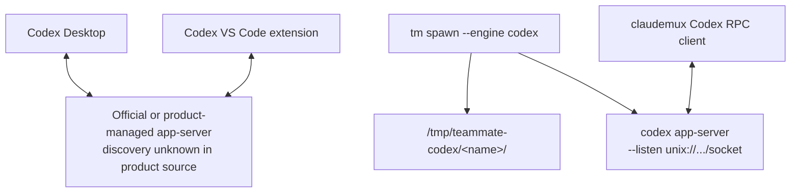

# Codex multi-client live sync - proposal

## Status

This is a research proposal only. It records what the current claudemux code
does, what the current upstream Codex app-server code supports, where the
Desktop and VS Code product behavior is still not source-confirmed, and which
implementation path should be validated before changing claudemux behavior.

Source scope:

- upstream Codex source snapshot:
  `openai/codex@9f42c89c0112771dc29100a6f3fc904049b2655f`, inspected from a
  temporary clone outside this repo
- local historical KB:
  [decision multi-engine-tui-architecture](/.agents/decisions/multi-engine-tui-architecture.md)
  and [domain node-cli-orchestrator](/.agents/domains/node-cli-orchestrator.md)

## Current claudemux behavior

`tm spawn <name> --engine codex` creates a claudemux-owned Codex app-server
daemon per teammate.

The path is:

- `/plugins/claudemux/core/src/verbs/spawn.ts:34` routes `spawn` to the selected
  engine.
- `/plugins/claudemux/core/src/engines/codex/engine.ts:390` reserves the
  teammate record and calls `spawnDaemon`.
- `/plugins/claudemux/core/src/engines/codex/supervisor.ts:322` starts a
  detached app-server process.
- `/plugins/claudemux/core/src/engines/codex/supervisor.ts:368` builds the
  command as `codex app-server --listen unix://<socketPath>`.
- `/plugins/claudemux/core/src/engines/codex/persistence.ts:46` stores the
  Codex registry under `/tmp/teammate-codex` by default.
- `/plugins/claudemux/core/src/engines/codex/persistence.ts:62` builds each
  teammate socket as `/tmp/teammate-codex/<name>/socket`.
- `/plugins/claudemux/core/src/engines/codex/rpc.ts:126` connects to that Unix
  socket using WebSocket-over-Unix (`ws+unix://...`).
- `/plugins/claudemux/core/src/engines/codex/engine.ts:929` initializes the
  app-server connection with `clientInfo.name = "claudemux"`.

The transport is not stdio. claudemux already uses Codex's Unix-socket
WebSocket JSON-RPC transport. The important difference is ownership and
discovery: claudemux starts private per-teammate app-servers on private
`/tmp/teammate-codex/<name>/socket` paths, and only claudemux records those
paths.

The current topology is:



This explains the observed isolation without assuming a product bug:
Desktop/VS Code have no known reason to discover or attach to
`/tmp/teammate-codex/<name>/socket`, while claudemux has no code that discovers
or attaches to the product-managed app-server network.

## Upstream Codex app-server facts

The current upstream app-server supports more than the older stdio-only mental
model.

Transport facts from upstream Codex:

- `codex-rs/cli/src/main.rs:436` exposes `codex app-server`.
- `codex-rs/app-server/src/main.rs:21` documents `--listen` values:
  `stdio://`, `unix://`, `unix://PATH`, `ws://IP:PORT`, and `off`.
- `codex-rs/app-server-transport/src/transport/mod.rs:46` defines the default
  control socket directory under `$CODEX_HOME/app-server-control`.
- `codex-rs/app-server-transport/src/transport/mod.rs:105` parses an empty
  `unix://` as the default control socket
  `$CODEX_HOME/app-server-control/app-server-control.sock`.
- `codex-rs/app-server-transport/src/transport/stdio.rs:24` creates one stdio
  connection from stdin/stdout.
- `codex-rs/app-server/src/lib.rs:659` sets `single_client_mode` only for
  stdio.
- `codex-rs/app-server/src/lib.rs:665` starts stdio, Unix socket, WebSocket, or
  no local listener depending on the transport.
- `codex-rs/app-server-transport/src/transport/unix_socket.rs:46` accepts
  multiple Unix-socket connections and upgrades each one to WebSocket.
- `codex-rs/app-server-transport/src/transport/websocket.rs:172` assigns a
  distinct `ConnectionId` to each WebSocket connection.

Multi-client routing facts:

- `codex-rs/app-server/src/lib.rs:733` keeps outbound connection state in a
  `HashMap<ConnectionId, OutboundConnectionState>`.
- `codex-rs/app-server/src/thread_state.rs:244` stores each thread's subscribed
  connection IDs.
- `codex-rs/app-server/src/thread_state.rs:432` attaches a connection to an
  existing thread.
- `codex-rs/app-server/src/request_processors/thread_lifecycle.rs:291` looks up
  current subscribed connection IDs for each thread event.
- `codex-rs/app-server/src/request_processors/thread_lifecycle.rs:311` sends
  thread events to the subscribed connections.
- `codex-rs/app-server/src/lib.rs:1024` tries to attach initialized
  connections to newly created threads.

Daemon and product-facing clues:

- `codex-rs/app-server/README.md` says the app-server powers rich interfaces
  such as the Codex VS Code extension.
- `codex-rs/app-server/README.md` documents `codex app-server proxy`, which
  opens one raw stream to the default control socket or a supplied `--sock`.
- `codex-rs/app-server-daemon/README.md` describes an experimental daemon
  lifecycle used by remote clients such as desktop and mobile apps.
- `codex-rs/app-server-daemon/src/lib.rs:244` uses the default Codex home and
  default control socket path for the daemon environment.
- `codex-rs/app-server-transport/src/transport/remote_control/protocol.rs:153`
  maps remote-control connections to ChatGPT `/wham/remote/control/server/...`
  endpoints.

The old statement "stdio is single-client" is still true. It is not enough to
explain the current product behavior, because Unix socket, WebSocket, daemon,
and remote-control paths now exist and are service-style connection surfaces.

### Reconciliation with the prior daemon/proxy rejection

[domain node-cli-orchestrator](/.agents/domains/node-cli-orchestrator.md)
records that the `codex app-server daemon` and `codex app-server proxy`
subcommands were previously evaluated and rejected: `daemon` was tied to an
OpenAI-hosted installation, and `proxy` is a raw byte tunnel that cannot carry
the WebSocket-framed `app-server` listen socket. That decision still stands
for the per-teammate spawn path it was made for — claudemux owning a private,
self-supervised app-server.

This proposal does not re-open that decision for the per-teammate mode. It
re-examines `daemon`/`proxy` only as **a connection target to an already-running
official server**, which is a different question:

- Treating the default
  `$CODEX_HOME/app-server-control/app-server-control.sock` as a connection
  target is a separate path from `daemon start` — Option A's primary mode is
  "if a live official socket exists, connect to it", not "claudemux runs the
  daemon".
- Whether `codex app-server daemon start` is even a viable fallback on the
  upstream version this proposal cites must be re-verified: `daemon ready`
  / `daemon start` semantics, whether enrollment / installation identity is
  still required, and whether starting it conflicts with a Desktop- or
  VS Code-owned daemon are all open. None of this is assumed; all of it is
  in the unknowns gate below.
- `codex app-server proxy` is still a raw stream and is referenced here only
  as a probe tool, not as a claudemux transport.

The net effect: prior decision intact for per-teammate ownership; this
proposal extends the design space with "attach to a server claudemux did
not start", and the daemon-as-fallback option is conditional on a live probe.

## Desktop APP / VS Code shared mechanism

The open-source Codex repo confirms the app-server side of multi-client
subscription, but it does not contain the closed Desktop app or the packaged
VS Code extension implementation that would prove the exact product discovery
path.

Confirmed from source:

- The app-server can hold multiple live connections when the transport is Unix
  socket, TCP WebSocket, or remote-control.
- Thread subscriptions are connection-scoped. A thread can have multiple
  subscribed clients, and events are sent to those clients.
- The default Unix control socket is
  `$CODEX_HOME/app-server-control/app-server-control.sock`.
- `codex app-server proxy` and `codex app-server daemon` are official entry
  points around that default control socket.
- The remote-control transport bridges server and clients through ChatGPT
  remote-control WebSocket endpoints.

Not source-confirmed from the open-source repo:

- Whether the current Desktop app and the current VS Code extension both use
  the default local Unix control socket.
- Whether one of them starts `codex app-server daemon` and the other discovers
  it.
- Whether their observed live sync is local-only, remote-control-backed, or a
  product-level broker above the open-source app-server.
- Whether either product filters visible threads by `clientInfo`,
  `SessionSource`, profile, installation ID, or another product-only field.

The safest conclusion is therefore:

> The shared network the user observes is real, but the open-source code only
> proves the reusable app-server primitives. It does not yet prove the exact
> Desktop/VS Code discovery contract.

## Why claudemux is currently invisible

claudemux app-servers are separate islands:

- They are launched by claudemux, not by the official daemon lifecycle.
- They listen on private `/tmp/teammate-codex/<name>/socket` paths.
- They are not the default `$CODEX_HOME/app-server-control/app-server-control.sock`.
- They are not started with remote-control enabled.
- Desktop/VS Code have no known registry entry that points them at those
  sockets.
- claudemux currently opens a connection only when a `tm` verb needs work,
  then closes it after the operation. It does not run a persistent UI client
  that would behave like a Desktop or VS Code tab.

This is compatible with the user's observation: a Desktop/VS Code conversation
can sync because both clients are inside one discovered app-server or broker
network, while a claudemux teammate lives in a different app-server process.

## What "live sync" means here — connection model question

Upstream thread subscriptions are **connection-scoped**: a connection that
initializes, calls `thread/start` or `thread/attach`, and stays open receives
that thread's `item/*` and `turn/completed` events; a connection that closes
stops receiving them
(`codex-rs/app-server/src/thread_state.rs:244`,
`codex-rs/app-server/src/request_processors/thread_lifecycle.rs:311`).

claudemux today is short-connection: `tm send` opens a client, drives one
turn, observes `turn/completed`, and closes. There is no resident
claudemux-side subscriber.

"Live sync" can therefore mean two distinct things, and the options below
are not equivalent under them:

- **(a) Outbound visibility only.** A claudemux-created thread, persisted on
  the shared server, becomes visible to Desktop/VS Code, which subscribe and
  display it. claudemux remains short-connection; it never receives events
  triggered by other clients in real time. The thread itself is the shared
  state; the sharing happens because Desktop/VS Code are the long-lived
  subscribers.
- **(b) Bidirectional live subscription.** claudemux additionally keeps a
  resident connection that stays subscribed to the thread, so that when a
  user types in Desktop or VS Code, claudemux sees the items immediately
  and can react (display, log, drive follow-up work).

Implications for the options:

- **(a)** is sufficient for the user's stated goal "I want to see my
  claudemux teammates in Desktop / VS Code". It is also the smaller change:
  Option A in mode (a) keeps the short-connection lifecycle and only swaps
  the socket. Whether (a) works at all still depends on the unknowns —
  whether Desktop/VS Code surface threads created by `clientInfo.name =
  "claudemux"`, and whether they filter by session source.
- **(b)** requires a new resident component in claudemux (or extending an
  existing resident, e.g. the dispatcher process) that owns a long-lived
  connection per active teammate thread. It changes the lifecycle model,
  not just the transport. It is the only way claudemux can react to
  events originated by Desktop/VS Code without polling.

The default scope for this proposal is **(a)**, because it is the minimum
that addresses the observed problem and the unknowns about product
discovery dominate the design choice either way. Mode (b) is recorded as a
follow-on once (a) is validated — it should not be folded into the first
implementation.

## Option A: attach claudemux to the official managed app-server

Make claudemux optionally connect to the official Codex app-server control
socket instead of spawning a private app-server per teammate.

Implementation path:

- Add a Codex engine mode that discovers
  `$CODEX_HOME/app-server-control/app-server-control.sock`.
- If the socket is live, use the existing
  `/plugins/claudemux/core/src/engines/codex/rpc.ts` WebSocket-over-Unix
  client against that socket.
- If the socket is absent, either:
  - fail with a clear diagnostic, or
  - optionally run `codex app-server daemon start` and then connect to the
    default socket.
- Keep teammate identity, cwd, and thread ID in claudemux's registry, but stop
  treating each teammate as owning a dedicated app-server process in this mode.
- Initialize with a stable `clientInfo.name` such as `claudemux`, then create
  or resume Codex threads as today.

Backward compatibility:

- Keep the current per-teammate daemon mode as the default until a live product
  probe confirms that Desktop/VS Code attach to the same default socket.
- Add the shared mode as an opt-in engine option or environment-controlled
  mode.
- Existing private daemon registries under `/tmp/teammate-codex/<name>/` remain
  valid for the default mode.

Performance and resource impact:

- Best RSS reduction among the practical options: N teammate app-server
  processes can collapse into one official daemon process.
- The cost shifts to shared process contention and one larger app-server state
  manager.
- Long-lived Desktop/VS Code clients plus claudemux clients may increase
  fanout traffic, but the app-server already has explicit per-connection
  routing.

Desktop / VS Code compatibility:

- High if the products use the default Unix control socket or official daemon
  lifecycle.
- Low if the products use only a product-private broker or filter out
  non-product clients.
- Unknown until a live probe verifies that a `thread/start` from
  `clientInfo.name = "claudemux"` appears in Desktop/VS Code.

Risks and unknowns:

- The app-server may broadcast server requests such as approvals or user
  prompts to multiple initialized clients. claudemux must verify request
  routing before enabling this by default.
- Product clients may auto-subscribe to claudemux-created threads and display
  noisy teammate work unless filtered.
- A shared daemon means one failure or incompatible setting can affect all
  teammates in that Codex home.
- Multiple claudemux worktrees could compete for the same official daemon.

## Option B: let claudemux own a shared multi-client app-server

Change claudemux from "one app-server per teammate" to "one shared app-server
per Codex home or dispatcher workspace", using a service-style Codex transport.

Implementation path:

- Start `codex app-server --listen unix://` so Codex chooses the default
  `$CODEX_HOME/app-server-control/app-server-control.sock`, or start
  `codex app-server daemon start`.
- Store a shared daemon record in a claudemux registry.
- Route all Codex teammates through that shared daemon, with each teammate
  represented by thread ID and cwd rather than by process ID.
- Optionally enable `--remote-control` only after validating its auth and
  enrollment semantics.

Backward compatibility:

- Preserve the current per-teammate mode as a fallback.
- The teammate state model must distinguish "logical teammate thread" from
  "owned daemon process"; otherwise `tm kill <name>` could accidentally kill
  the whole shared daemon.
- `tm doctor` needs separate stale-thread and stale-daemon diagnostics.

Performance and resource impact:

- Similar resource win to Option A if all teammates share one daemon.
- More lifecycle responsibility remains inside claudemux, especially around
  startup locks, stale sockets, and daemon ownership.
- Better than Option A when Desktop/VS Code are not already running, because
  claudemux can bring up the shared server itself.

Desktop / VS Code compatibility:

- Possible if claudemux uses the exact default control socket and product
  clients discover that socket.
- Weak if Desktop/VS Code only trust their own daemon bootstrap or a
  remote-control enrollment flow.
- A custom socket under `/tmp/teammate-codex` would not be enough; product
  clients would still not discover it.

Risks and unknowns:

- claudemux would become a lifecycle peer to the official Codex daemon and
  could conflict with product-managed startup.
- Remote-control behavior is not just local fanout; it adds ChatGPT
  enrollment, installation identity, and network state.
- The current "kill one teammate" semantics do not map directly to one shared
  process.

## Option C: add a claudemux broker or proxy

Introduce a local broker between claudemux and one upstream Codex app-server.
The broker would keep one upstream app-server connection and expose multiple
downstream logical clients or sockets.

Implementation path:

- Run a claudemux-owned broker process.
- Connect the broker upstream to either a private app-server or the official
  control socket.
- Have claudemux verbs connect downstream to the broker.
- Optionally expose a socket that Desktop/VS Code could connect to if those
  products support explicit socket selection.

Backward compatibility:

- The current per-teammate daemon can remain behind the broker, but that gives
  no Desktop/VS Code visibility unless the products connect to the broker.
- A broker-backed shared mode needs new ownership and shutdown semantics.

Performance and resource impact:

- Adds another resident process.
- Does not save much memory unless it also removes per-teammate app-servers.
- Adds latency and failure modes to a protocol that already supports multiple
  connections on Unix socket and WebSocket transports.

Desktop / VS Code compatibility:

- Poor unless Desktop/VS Code support explicit socket configuration or a
  documented discovery hook.
- If they do not, the broker can help claudemux internals but cannot make
  Desktop/VS Code see the teammate.

Risks and unknowns:

- The broker must correctly route JSON-RPC responses, server requests,
  notifications, thread subscriptions, and cancellation.
- It would duplicate app-server fanout behavior that upstream already has.
- It can easily become stale when upstream changes the app-server protocol.

## Option D: upstream or product-supported integration contract

Instead of reverse-engineering discovery, ask for or contribute a supported
contract that lets non-product clients register with the Desktop/VS Code shared
network.

Implementation path:

- Document the needed contract: discover a live app-server, initialize as a
  third-party client, create/resume threads, and subscribe to updates.
- Validate whether `codex app-server daemon`, `codex app-server proxy`, or
  remote-control is the intended supported surface.
- If missing, propose upstream changes in Codex rather than carrying a fragile
  claudemux-only workaround.

Backward compatibility:

- No change to the current claudemux mode until a supported surface exists.
- Once available, claudemux can add it as a new explicit mode.

Performance and resource impact:

- Depends on the supported surface, but should avoid duplicated app-servers if
  it formalizes the official shared daemon or remote-control path.

Desktop / VS Code compatibility:

- Best long-term compatibility if accepted upstream.
- Not a near-term solution if the contract is not already present.

Risks and unknowns:

- Product code may remain closed, so the contract may not be published soon.
- Remote-control may require account, installation, or policy state that is not
  appropriate for every claudemux user.

## Recommendation: Option A first, with Option B as fallback

The recommended next technical direction is an opt-in Option A prototype:
connect claudemux to the official managed app-server control socket when it is
already present, then live-validate whether Desktop/VS Code see a
claudemux-created thread.

Why:

- It uses the upstream multi-client app-server behavior directly instead of
  adding a fanout layer.
- It has the smallest claudemux transport change because
  `/plugins/claudemux/core/src/engines/codex/rpc.ts` already speaks
  WebSocket-over-Unix.
- It tests the exact user goal: joining the existing Desktop/VS Code network.
- It can preserve the current per-teammate daemon mode as a stable fallback.
- It can reduce resource usage if the official shared daemon path works.

Option B is the fallback when no official app-server is running or when
claudemux needs to provide a shared daemon on headless hosts. It should use the
default control socket if the goal is product visibility; a custom
`/tmp/teammate-codex/...` socket remains private unless product clients can be
pointed at it.

Option C is not recommended as the first implementation. The upstream
app-server already implements multi-client fanout for service-style
transports, and a proxy would recreate that behavior while adding protocol
routing risk.

## Unknowns to verify before implementation

These are the live probes that should gate any default behavior change:

- With Desktop and VS Code open, is there a live
  `$CODEX_HOME/app-server-control/app-server-control.sock`?
- Which process owns that socket?
- Does `codex app-server proxy` connect to the same server that Desktop/VS Code
  are using?
- If a third client initializes as `claudemux` and calls `thread/start`, does
  the new thread appear in Desktop/VS Code?
- If Desktop/VS Code start a turn, does the `claudemux` client receive the same
  `item/*` and `turn/completed` notifications after subscribing?
- Are approval or user-prompt requests sent to all subscribed clients, only the
  origin client, or product-selected clients?
- Do product clients filter threads by client name, session source, account,
  working directory, or remote-control installation ID?
- Does `codex app-server daemon start` conflict with Desktop/VS Code when one
  product has already started the server?
- Does enabling remote-control change local discovery or only add a
  cloud-backed connection plane?

Useful probe commands, to be run manually in a later implementation spike:

```bash
lsof -U | rg 'app-server-control|codex'
ps -ef | rg 'codex app-server|Codex'
codex app-server daemon ready
codex app-server proxy
```

## Implementation sketch if approved

The first implementation should be narrow and reversible:

- Add a Codex shared-server mode next to the current per-teammate mode.
- Discover the official socket from Codex home using the upstream default:
  `$CODEX_HOME/app-server-control/app-server-control.sock`.
- Reuse the existing
  `/plugins/claudemux/core/src/engines/codex/rpc.ts` client against that
  socket.
- Store per-teammate thread IDs and metadata, but mark the daemon as external
  so `tm kill <name>` does not kill the shared app-server.
- Add diagnostics to `tm inspect`, `tm status`, or `tm doctor` that show
  whether a Codex teammate is using a private daemon or the shared official
  socket.
- Add an explicit fallback path to the existing private daemon behavior.
- Validate with Desktop and VS Code before making the shared mode default.

The implementation should not start with remote-control. Remote-control is a
separate network plane with account and enrollment semantics; it should be
tested only after the local official socket path is understood.
