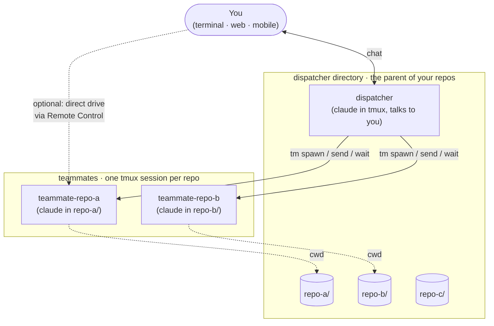

**English** · [简体中文](./README.zh-CN.md)

# claudemux

> `claude` + `tmux`. One dispatcher Claude Code session talks to you. One
> teammate Claude Code per repo runs in its own `tmux` session. You
> orchestrate the fleet in plain language.

## Architecture



## Drive teammates from anywhere

Every teammate is a real `claude` REPL with a Remote Control URL. Open the
URL in a browser or the mobile app and you're talking to that teammate
directly — no terminal needed.

- Check on a long-running teammate from your phone on the subway.
- Hand a teammate the next task from a laptop in a cafe while the
  dispatcher keeps coordinating the rest of the fleet.
- Three devices, three windows, one fleet — in parallel.

`/claudemux:setup` flips on Claude Code's `remoteControlAtStartup`, so
every teammate registers its URL the moment it spawns.

## Install

In any Claude Code session:

```
/plugin marketplace add excitedjs/claudemux
/plugin install claudemux@claudemux
/reload-plugins
```

Then `cd` to the parent of your sibling repos and start the dispatcher:

```bash
cd ~/path/to/your/dev-dir
claude
```

In the REPL:

```
/claudemux:setup
```

`/claudemux:setup` also seeds a `.workspace/` directory in your dispatcher dir holding three personalization files (`persona.md`, `user-profile.md`, `principles.md`) that get imported into every dispatcher session, plus `notes/` and `artifacts/` for long-term notes and dispatcher-generated intermediate output. The setup walks you through filling them in; you can skip and edit later. See `.workspace/README.md` in your dispatcher dir after setup for full layout.

## Quick start

Talk in plain language — the `dispatcher` skill picks up the intent:

> 派一个 teammate 去 repo-a 跑测试
>
> 看看 repo-b 现在在干啥
>
> 让 repo-a 跑 lint,同时让 repo-b 升级 react 到 19

Or call `tm` directly:

```bash
tm spawn repo-a --prompt 'run yarn test in unit-test'   # atomic: spawn + send + wait + print
tm send  repo-a --prompt 'now lint'                     # sync send: returns the reply on stdout
tm states                                               # fleet snapshot
tm kill  repo-a                                         # done
```

## The `tm` script

`tm` is on `PATH` inside any Claude Code session. To use it from a regular
terminal, see [Outside Claude Code](#using-tm-outside-claude-code).

| Subcommand | What it does |
|---|---|
| `tm ls` | List running teammate sessions. |
| `tm states` | Fleet snapshot: repo, sid, busy, last-reply size + age, first 50 chars. |
| `tm spawn <repo> [--task <slug>] [--prompt "…"]` | Launch a teammate for `<repo>`. With `--prompt`, atomic bootstrap: spawn + send + wait + print the first-turn reply on stdout. `--task <slug>` names the conversation (`<repo>-<slug>`; ASCII + CJK Han); default `<repo>-<rand4>`. |
| `tm resume <repo> [<sid-or-thread-id>] [--task <slug>] [--prompt "…"]` | Resume a prior conversation. Claude accepts a transcript `sid` and can auto-pick the newest jsonl when omitted. Codex requires an explicit thread id from `/tmp/teammate-codex/<name>/thread` or the rollout filename, starts a new app-server daemon, and calls `thread/resume`. `--prompt` sends a follow-up after relaunch (atomic like `spawn --prompt`). |
| `tm send <repo> --prompt "…" [--pane-quiet] [--timeout N]` | **Atomic round-trip**: send prompt + wait for the Stop hook + print the reply on stdout. The Stop-hook path also echoes the teammate's post-turn ctx to stderr (`ctx: N tokens · …`), eliminating the common "send, then `tm ctx`" follow-up; skipped on `--pane-quiet`. `--prompt` matches the calling form of `tm spawn --prompt` / `tm resume --prompt` (one API across all three verbs); flag order is free. `--pane-quiet` fallback for TUI-only commands (`/help`, `/effort`, permission prompts) that fire no hook. Exit codes: `0` reply landed; `124` sync wait expired and the teammate is still running (re-collect with `tm wait <repo>`; do NOT respawn — the name is taken); `1` real failure (no session, sid marker missing, …). |
| `tm wait <repo> [timeout=600] [--fresh] [--pane-quiet] [--timeout N]` | Block until the teammate's next Stop event and print the reply (ctx echo on stderr, same as `tm send`). Use when an external actor (Remote Control, mobile app, cron) drove the turn. `--fresh` waits for the NEXT Stop instead of returning on a stale marker (no-op under `--pane-quiet`). `--timeout N` is equivalent to the positional `[timeout]`. Same exit codes as `tm send`. |
| `tm compact <repo> [timeout=600] [--timeout N]` | Send `/compact` and verify PostCompact fired. Prints `compacted` on success. Doesn't read ctx — use a separate `tm ctx <repo>` or the inline echo on the next `tm send`. Default 600s — large contexts (~300k+) routinely take 3-4 minutes. Exit codes: `0` PostCompact fired; `1` `/compact` refused with "Not enough messages to compact" (pane-scan detects this and bails early instead of hanging); `124` PostCompact never fired within `--timeout` — compaction may still be running. |
| `tm last <repo>` | Print the full text of the teammate's last reply. Fresh-spawn sentinel: dies with "no reply yet" when called before any turn has settled. |
| `tm kill <repo>` | Kill the teammate's tmux session and clean up its state files. |
| `tm archive <id> [--status '<tag>']` | Move a closed task from `active-dispatcher-tasks.md` to the archive (outcome text on stdin). |
| `tm ctx <repo>… \| --all [--window 200k\|1m]` | Real context-window usage per teammate, read from the jsonl `usage` block. More accurate than the TUI percentage. |
| `tm history <repo> [<sid-or-thread-prefix>]` | List past Claude sessions or Codex threads for `<repo>` (newest first). Each row shows the full Claude `sid` or Codex thread id — the exact string `tm resume` accepts; the live session/thread is marked with `*`. Passing a sid / thread-id prefix opens detail view with a ready-to-paste `tm resume` command. |
| `tm mem <repo>` | Cat the sibling repo's auto-memory `MEMORY.md` (feature-gate names, branch names, in-progress projects). Read this before composing a `tm spawn` / `tm send --prompt` that quotes sibling state — the dispatcher's own AutoMemory does not include sibling repos. Missing memory → stderr notice + exit 0 + empty stdout. |
| `tm reload <repo>… \| --all` | Fan out `/reload-plugins` to teammates after a plugin update. |

Diagnostic-only (use when the verbs above don't fit): `tm status <repo>` to
capture the live pane, `tm poll <repo> <regex>` for intermediate-state polling.

Behavior contracts and the on-disk state are documented in
[`plugins/claudemux/skills/dispatcher/SKILL.md`](plugins/claudemux/skills/dispatcher/SKILL.md).

## `/claudemux:optimize` — periodic self-review

A bundled skill that scans the dispatcher's recent conversations, spots
recurring foot-guns or undocumented conventions, and writes them into
your `CLAUDE.md` or project memory. Runs in a forked context, returns a
short report. Invoke manually, or schedule it with `CronCreate` for a
weekly pass.

## Requirements

| Tool | Why |
|---|---|
| Claude Code CLI | The plugin attaches to it. |
| Node 22.7+ | The `tm` CLI runs the orchestration core (TypeScript) through Node's experimental type-transform pipeline directly from source — no `npm install`, no build step. 22.7 is the version that introduced `--experimental-transform-types`. |
| `tmux` | Teammates live in tmux sessions. |
| `jq` | The Stop hook parses harness JSON. |
| `bash` | Plugin scripts use Bash features. |
| macOS or Linux | Scripts use BSD `stat`; Windows is unsupported. |

## Configuration

None. The dispatcher directory is wherever you `cd` and run `claude` —
`tm` derives it from `$PWD` at invocation. Move it by `cd`'ing
elsewhere; there is no global state file.

## Using `tm` outside Claude Code

`tm` lives at `bin/tm` in the plugin. From a regular terminal, symlink
it once:

```bash
ln -sf ~/.claude/plugins/cache/claudemux/claudemux/<version>/bin/tm ~/.local/bin/tm
```

Make sure `~/.local/bin` is on your `PATH`. Replace `<version>` with the
installed version.

## Known limitations

- **Single dispatcher root.** `tm spawn <repo>` resolves `<repo>` as
  `$PWD/<repo>`, so sibling repos must share one parent.
- **macOS / Linux only.** Scripts use BSD `stat`; GNU Linux needs
  `-c %Y` — PRs welcome.
- **Cron only fires inside the dispatcher REPL.** `CronCreate` from
  `claude -p` or an Agent Teams teammate returns success then never fires.

## Local development

### One-off

```bash
git clone https://github.com/excitedjs/claudemux ~/src/claudemux
claude --plugin-dir ~/src/claudemux/plugins/claudemux
```

### Persistent (recommended)

```bash
claude plugin marketplace add ~/src/claudemux --scope local
claude
# in the REPL:
/plugin install claudemux@claudemux
```

`/reload-plugins` hot-reloads skills, commands, hooks, and `tm` — no
restart needed.

Enable the pre-commit hook once after cloning:

```bash
git config core.hooksPath .githooks
```

It rejects commits with an invalid author email. Claudemux release intent is
declared with official Changesets fragments:

```bash
pnpm --dir plugins/claudemux changeset
```

Feature PRs commit the generated `.changeset/*.md` file; generated release PRs
later consume those fragments into the plugin version and changelog.

## Uninstall

```
/plugin uninstall claudemux
```

Removes the plugin and its hooks. Your dispatcher directory's
`CLAUDE.md` is left in place — delete it by hand if you don't want it.

## License

MIT — see [LICENSE](LICENSE).
