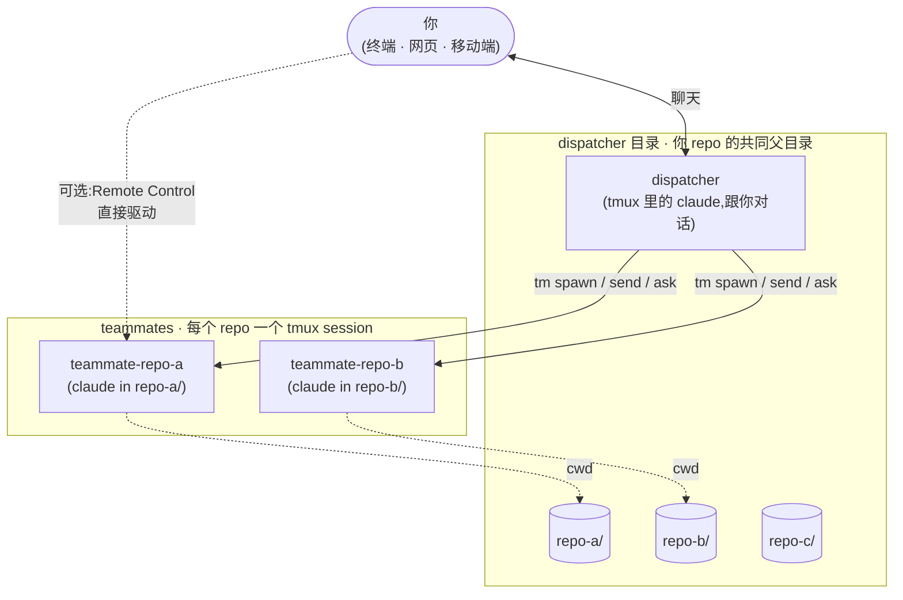

[English](./README.md) · **简体中文**

# claudemux

> 一个 Claude Code 会话调度多个。在多仓父目录跑一个 **dispatcher**,为每个 repo
> 在 `tmux` 里起一个 **teammate**,用大白话指挥它们,跨天保留状态。

名字是 `claude` + `tmux`。结构是一个 *dispatcher*(你说话的那个 Claude Code 会话)
加若干 *teammate*(每个 repo 一个 Claude Code,各在自己的 `tmux` session 里)。

## 这东西解决什么问题

如果你在一个父目录下放了一堆 sibling repo,又发现自己要同时开五个 Claude Code 会话
在它们之间来回切——倒上下文、各自问"你做完了吗"——`claudemux` 把这一切折叠成
**一次对话**。Dispatcher 把活分发到正确的 repo,阻塞等 teammate 回话,并提供一个集中
的地方挂周期任务(CI 看板、状态轮询),跨会话存活。

因为每个 teammate 都是 `tmux` 里真实跑着的 `claude` REPL,它会自动注册自己的
Claude Code Remote Control URL——你可以在 dispatcher 主指挥之外,还从
`claude.ai/code` 或手机 app 直接驱动任意 teammate。

## 架构



Dispatcher 持有对话,teammate 干活。中间的所有事情——起、发 prompt、等回话、收死掉
的——都走插件随包安装到 `PATH` 上的 `tm` 脚本。

## 安装

在任意 Claude Code 会话里:

```
/plugin marketplace add excitedjs/claudemux
/plugin install claudemux@claudemux
/reload-plugins
```

`/reload-plugins` 让插件附带的 Stop hook 立即在当前 Claude Code 进程生效,不需要
重启。

然后,在你想作为 dispatcher 根目录(你 sibling repo 们的共同父目录)的目录里:

```bash
cd ~/path/to/your/dev-dir
claude
```

在 REPL 里:

```
/claudemux:setup
```

`/claudemux:setup` 把 `CLAUDE.md`(dispatcher 工作约定)放进当前目录,并问你是
否打开 Claude Code 的 `remoteControlAtStartup`——开了之后每个 teammate 都会有
自己的 Remote Control URL。**不写任何全局配置文件**:`tm` 和 hook 在运行时
直接用 `$PWD` 推 dispatcher 目录,你 `cd` 到哪、`claude` 跑起来的那个地方就
是 dispatcher。

## 快速上手

在 dispatcher 目录里,直接用大白话说:

> 派一个 teammate 去 repo-a 跑测试
>
> 看看 repo-b 现在在干啥
>
> 让 repo-a 跑 lint,同时让 repo-b 升级 react 到 19

`dispatcher` 技能会自动触发,你不需要点名它。

也可以跳过对话,直接用 `tm`:

```bash
tm spawn repo-a                                # 起 teammate
tm ask   repo-a 'run yarn test in unit-test'   # 发送 + 等待 + 打印回复
tm states                                      # 一览所有 teammate 状态
tm kill  repo-a                                # 收掉
```

## `tm` 脚本

`tm` 在任意 Claude Code 会话里自动在 `PATH` 上。Claude Code 之外的终端要用,做一次
软链(见[在 Claude Code 之外用 `tm`](#在-claude-code-之外用-tm))。

| 子命令 | 作用 |
|---|---|
| `tm ls` | 列出所有正在跑的 teammate session。 |
| `tm states` | 一行一个 teammate 的整体状态:repo、sid、是否在干活、上次回复的字节数 + 多久前、首 50 字预览。"现在每个人在干啥"一眼能看完。 |
| `tm spawn <repo>` | 在新 tmux session 里为 `<repo>`(dispatcher 根下的一个目录)起一个 teammate。session id 预先生成,等待/读最近回复立刻可用。 |
| `tm resume <repo> [<sid>]` | 恢复一个旧会话。**优先**传 `sid`(从你的任务台账里拿);不传则按 mtime 选最新 jsonl(会在 stderr 警告)。 |
| `tm send <repo> <prompt…>` | 发送一条 prompt + Enter。两段式 Enter、多行提交那两个坑都已经处理。 |
| `tm ask [--quiet] [--timeout=N] <repo> <prompt…>` | round-trip 原语:发送 + 等待 + 把 assistant 完整回复打到 stdout。pipe 友好。`/compact` 这种不触发 Stop 的场景用 `--quiet`。 |
| `tm wait-idle <repo> [timeout]` | 阻塞到 teammate Stop hook 触发(= 一次 turn 结束)。 |
| `tm wait-quiet <repo> [timeout]` | 阻塞到 teammate pane 上"在干活"的转圈消失几秒。Stop 不会触发的场景(`/compact` / `/clear`)用这个。 |
| `tm last <repo>` | 打印 teammate 上一轮回复的**完整正文**。需要全文时用它,不要用 `tm status`——tmux scrollback 会截断。 |
| `tm status <repo> [lines]` | capture-pane 看 teammate 实时屏幕。 |
| `tm poll <repo> <regex> [timeout]` | 阻塞到 pane 内容匹配正则。`wait-idle` / `wait-quiet` 都不适用时兜底用。 |
| `tm kill <repo>` | 干掉 teammate 的 tmux session,清理状态文件。 |

### 等待原语怎么工作

每个 Claude Code 会话在每个 turn 结束时都会触发 Stop 事件。插件的 Stop hook 按
session id 写两个文件:

- `/tmp/claude-idle/<sid>` — 零字节 touch,wait-idle 等的就是它。
- `/tmp/claude-idle/<sid>.last` — assistant 上一轮回复的纯文本(只取可见 text block,
  tool 调用和内部思考排除)。

`tm send` 在发送之前把这两个文件清掉,所以之后 `wait-idle` / `last` 反映的是
**这一次** turn,不是上一次。hook 在写 `.last` 之前会等到 jsonl 里最近一个
assistant API 响应的 `stop_reason` 进入终态,所以 `.last` 要么完整、要么不存在,
**不会**出现"看起来正常但其实少了最后一段"的伪完整。

`tm wait-quiet` 是姊妹原语,看的是 pane 实时画面里的转圈,不依赖 hook 信号——
teammate 在跑斜杠命令(`/compact` 等)、不会触发 Stop 时用它。

## `/claudemux:optimize` — 周期自检

随包一个 skill。它扫 dispatcher 自己最近的对话记录,识别反复踩的坑、没沉淀的约定,
按正确的载体提升:

- 每次 dispatcher 会话都该生效的行为规则 → 你的 `CLAUDE.md`
- 仅 dispatcher 相关的私人补充 → `<dispatcher-root>/.claude/local-dispatcher-notes.md`
- 情境性事实 → 项目 memory(`~/.claude/projects/<encoded>/memory/`)

它在 fork 出来的独立上下文里运行(扫日志不会污染你的当前会话),最后返回一份简短
的结构化报告。手动调用 `/claudemux:optimize`,或用 `CronCreate` 排成每周一次。

## 配置

**没有**。插件不保留任何全局状态文件。「dispatcher 目录」就是你 `cd` 过去
跑 `claude` 的那个地方——`tm` 在调用时直接拿 `$PWD`(`tm spawn foo` →
`$PWD/foo`);SessionStart hook 通过 `tm spawn` 写下的 `/tmp/teammate-<repo>.cwd`
文件,把每次 SessionStart 的 cwd 跟文件内容**逐字节比对**来识别 teammate。
要换 dispatcher 目录就直接 `cd` 到别的地方——没东西要编辑。

> ⚠️ 文档里的 `$DEV_DIR` 偶尔作为「dispatcher 目录」的占位符出现,不是真的
> shell 变量。如果你从文档 copy 一条命令到 shell,要把 `$DEV_DIR` 换成实际路径。

`<dispatcher-root>/.claude/local-dispatcher-notes.md` 是可选的用户私有补充文件。
`/claudemux:optimize` 会把 dispatcher 私域的约定追加到这里;随包的 dispatcher
skill 在触发时会读。**你不想被插件升级覆盖的笔记**放这里最安全。

## 依赖

| 工具 | 用途 |
|---|---|
| Claude Code CLI | 插件挂在它上面。 |
| `tmux` | Teammate 都跑在 tmux session 里。 |
| `jq` | Stop hook 解析 harness JSON。 |
| `bash` | 插件脚本用 Bash 特性(macOS 自带的 `bash` 和任何 Linux 发行版都够)。 |
| macOS 或 Linux | 脚本用了 BSD `stat -f %m`,GNU Linux 上是 `-c %Y`(PR welcome)。 |

## 在 Claude Code 之外用 `tm`

`tm` 在插件里位置是 `bin/tm`,Claude Code 启动时会把每个已装插件的 `bin/` 加进
`PATH`。从普通终端(没在 Claude Code 会话里)要用的话,做一次软链:

```bash
ln -sf ~/.claude/plugins/cache/claudemux/claudemux/0.1.0/bin/tm ~/.local/bin/tm
```

确认 `~/.local/bin` 在你的 `PATH` 上。版本号有更新就换成新版。

## 本地开发

两种方式把 Claude Code 指向本地 checkout,绕开 marketplace 装的副本。

**一次性** — 直接挂插件目录:

```bash
git clone https://github.com/excitedjs/claudemux ~/src/claudemux
claude --plugin-dir ~/src/claudemux/plugins/claudemux
```

**持久(迭代开发推荐)** — 把本地 repo 注册为 marketplace,再装:

```bash
claude plugin marketplace add ~/src/claudemux --scope local
claude
# 在 REPL 里:
/plugin install claudemux@claudemux
```

`--scope local` 只在当前项目生效;`--scope user` 全局生效。

**迭代循环**。skill、command、hook、`tm` 脚本的所有改动都通过 `/reload-plugins`
热加载——不需要重启 Claude Code。如果怀疑缓存有问题(比如新装后 `tm` 还不在
`PATH` 上),重启 Claude Code 是终极方案。

## 已知限制

- **只支持单 dispatcher 根**。`tm spawn <repo>` 把 `<repo>` 按 `$PWD/<repo>`
  解,所有 sibling repo 必须共享一个父目录。多根布局得手动传绝对路径。
- **只 macOS / Linux**。多个脚本用了 BSD `stat`,Windows 不支持。
- **Cron 只在 dispatcher REPL 里 fire**。`claude -p` 或 Agent Teams teammate 里
  `CronCreate` 返回成功但永远不触发——所有周期任务挂在 dispatcher 上。

dispatcher skill 内部沉淀了一份更长的"踩过的坑"清单,见
[`plugins/claudemux/skills/dispatcher/SKILL.md`](plugins/claudemux/skills/dispatcher/SKILL.md)。

## 卸载

```
/plugin uninstall claudemux
```

会把插件和它的 hook 一起摘掉。**一样**东西不自动清,要的话手动删:

- 你 dispatcher 目录里的 `CLAUDE.md` — 留着,因为你可能想把那份 dispatcher
  约定文档作为参考保留。

(插件不保留任何全局状态文件——没别的可清的。)

## 许可

MIT — 见 [LICENSE](LICENSE)。
