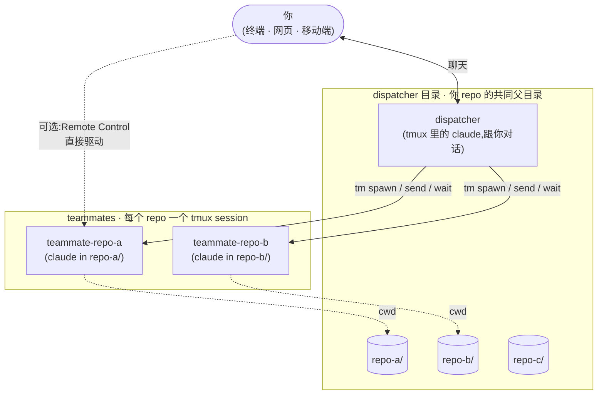

[English](./README.md) · **简体中文**

# claudemux

> **worktree 默认 + name/repo 解耦(1.0 切换)**。`tm spawn <path>` 改为吃文件系统路径;teammate `<name>` 是独立的 flat 标识符(`--name` 显式给,或自动生成 `<basename>-<rand4>`)。其余 verb 全部按 `<name>` 寻址。Teammate 默认跑在 `<path>/.claude/worktrees/<name>/` 这个 worktree 里;`--no-worktree` 退出。**升级前的 teammate 需要 `tm kill` 然后重新 `tm spawn` —— schema 1 → 2 没有静默迁移。**Codex 路径暂不支持 `.worktreeinclude`,需要 `.env` 等文件请手动拷贝到 worktree。决策记录:[`.agents/decisions/worktree-default-and-name-repo-decoupling.md`](./.agents/decisions/worktree-default-and-name-repo-decoupling.md)。

> `claude` + `tmux`。一个 dispatcher 会话跟你对话,每个 repo 一个 teammate
> 跑在自己的 tmux session 里,你用大白话指挥整支 fleet。

## 架构



## 跨设备驱动 teammate

每个 teammate 都是真实的 `claude` REPL,自带 Remote Control URL。浏览器
打开、手机 app 打开,就是直接在跟这个 teammate 对话——不用回终端。

- 地铁上用手机看长跑的 teammate 进展
- 咖啡馆笔记本上接着派新活,dispatcher 同时继续协调其他 teammate
- 三台设备三个窗口,并行驱动同一支 fleet

`/claudemux:setup` 会帮你打开 Claude Code 的 `remoteControlAtStartup`,
之后每个 teammate 一起来就注册好自己的 URL。

## 安装

任意 Claude Code 会话里:

```
/plugin marketplace add excitedjs/claudemux
/plugin install claudemux@claudemux
/reload-plugins
```

然后 `cd` 到你 sibling repo 的共同父目录,启动 dispatcher:

```bash
cd ~/path/to/your/dev-dir
claude
```

REPL 里:

```
/claudemux:setup
```

`/claudemux:setup` 还会在 dispatcher 目录里建一个 `.workspace/`,放三个 personalization 文件(`persona.md` / `user-profile.md` / `principles.md`),每次 dispatcher session 启动都会 `@import` 进上下文;另外还有 `notes/`(长期手记)和 `artifacts/`(dispatcher 自动产生的中间产物)。setup 会引导你填,也可以跳过先生成空 stub 之后再编辑。详细布局看 dispatcher dir 下 `.workspace/README.md`。

## 快速上手

直接说人话,`dispatcher` 技能会接住:

> 派一个 teammate 去 repo-a 跑测试
>
> 看看 repo-b 现在在干啥
>
> 让 repo-a 跑 lint,同时让 repo-b 升级 react 到 19

或者直接调 `tm`:

```bash
tm spawn repo-a --name testbot --prompt 'run yarn test in unit-test'   # 原子化:起 + 派 + 等 + 打印首轮回话
tm send  testbot --prompt '接着跑 lint'                                 # 同步 send,回话直接落 stdout
tm states                                                              # 一览整支 fleet
tm kill  testbot                                                       # 收掉
```

第一个位置参是 `<path>`(这里是 dispatcher 的同级目录 `repo-a`)。teammate
的标识符是 `--name` 传的那个,或者(不传 `--name` 时)spawn 在 stderr 打的
自动生成 `<basename>-<rand4>`(`spawned: repo-a-7d3a`)。其它动词全部按这个
flat 标识符寻址。

## `tm` 命令

Claude Code 会话里 `tm` 自动在 `PATH` 上。会话外用法见
[在 Claude Code 之外用 `tm`](#在-claude-code-之外用-tm)。

`tm spawn` 是唯一吃文件系统路径的动词。其它动词全部按 spawn 返回的 flat
`<name>` 寻址 —— 从 spawn 的 stderr (`spawned: <name>`) 里捕获,后面一直用。
name 必须 match `^[A-Za-z0-9][A-Za-z0-9_-]*$`,且全局唯一。

| 子命令 | 作用 |
|---|---|
| `tm ls` | 列出 teammate:`NAME REPO WORKTREE ENGINE STATE`。 |
| `tm states` | 整体快照:`NAME REPO WORKTREE ENGINE STATE LAST PREVIEW`,`state` 是 `idle` / `busy` / `unknown`。 |
| `tm spawn <path> [--name <id>] [--engine claude\|codex] [--prompt "…"] [--no-worktree] [--timeout N]` | 在 `<path>` 起 teammate(绝对路径,或者相对 dispatcher 根目录)。默认把 teammate 放进 `<path>/.claude/worktrees/<name>/` 这个 worktree(分支 `worktree-<name>`,base ref `HEAD`);`--no-worktree` 直接跑在 `<path>` 本身。`--name <id>` 显式给名字(全局唯一);不传就是 `<basename(path)>-<rand4>`。带 `--prompt` 即原子 bootstrap:spawn + send + 等 Stop + 把首轮回话打到 stdout。 |
| `tm resume <name> [<sid-or-thread-id>] [--prompt "…"] [--engine claude\|codex]` | 按 teammate 名字恢复旧会话。Claude 用 transcript `sid`,不传可按 mtime 选最新 jsonl。Codex 必须显式传 `/tmp/teammate-codex/<name>/thread` 或 rollout 文件名里的 thread id,会重新起 app-server daemon 并调用 `thread/resume`。`--prompt` 在重连后派 prompt(行为同 `spawn --prompt`)。 |
| `tm send <name> --prompt "…" [--pane-quiet] [--timeout N]` | **原子 round-trip**:发 prompt + 等 Stop + 把回话打到 stdout。Stop-hook 路径还把当前 ctx 顺手打到 stderr(`ctx: N tokens · …`),消灭 send 完再单独 `tm ctx` 的高频模式;`--pane-quiet` 不打。`--prompt` 和 `tm spawn --prompt` / `tm resume --prompt` 一套写法;flag / `<name>` 顺序自由。`--pane-quiet` 给 TUI-only(`/help` / `/effort` / 权限弹窗)兜底,这些路径不触发 hook。退码:`0` 拿到回话;`124` sync wait 超时,但 teammate 还在跑(用 `tm wait <name>` 续等;别重新 spawn,name 还占着);`1` 真失败(没 session / sid marker 缺失等)。 |
| `tm wait <name> [timeout=600] [--fresh] [--pane-quiet] [--timeout N]` | 阻塞到 teammate 下一次 Stop,打回话到 stdout(ctx 走 stderr,行为同 `tm send`)。外部驱动(Remote Control / 移动端 / cron)推动的 turn 用这个收。`--fresh` 等下一次 Stop 而不是被已有 marker 立即满足(`--pane-quiet` 模式下 `--fresh` 不生效)。`--timeout N` 等价位置参数 `[timeout]`。退码同 `tm send`。 |
| `tm compact <name> [timeout=600] [--timeout N]` | 发 `/compact` + 等 PostCompact;成功 stdout 一行 `compacted`。默认 600s 是因为大上下文(~300k+)实测要 3-4 分钟。退码:`0` PostCompact 触发;`1` Claude Code 回 "Not enough messages to compact";`124` `--timeout` 到了 PostCompact 还没触发。 |
| `tm last <name> [--verbose]` | 打印 teammate 上一轮回复的完整正文。fresh spawn 之后还没派活时,die 报 "no reply yet"。Codex teammate 加 `--verbose` 打原始 turn JSON。 |
| `tm kill <name>` | 优雅 `/exit`(clean worktree 由 Claude 自动清);dirty worktree 保留并在 stderr 提示用 `git worktree remove --force` 收尾。`/exit` 超时则 fallback `tmux kill-session`(SIGHUP)。 |
| `tm archive <id> [--status '<tag>']` | 把 `active-dispatcher-tasks.md` 里一个收尾的 task 搬到 archive(收尾文字从 stdin 进)。 |
| `tm ctx <name>… \| --all [--window 200k\|1m]` | 每个 teammate 的真实上下文用量,从 jsonl 的 `usage` 字段读,比 TUI 那个百分比准。 |
| `tm history <name> [<sid-or-thread-prefix>]` | 列这个 teammate 的 Claude 历史 session 或 Codex thread(最新在前)。每行显示完整的 Claude `sid` 或 Codex thread id —— 即 `tm resume` 接受的字符串;当前 live session/thread 标 `*`。传 sid / thread-id 前缀则展开详情,并给出可直接粘贴的 `tm resume` 命令。 |
| `tm mem <name>` | cat 父 repo 的 auto-memory `MEMORY.md`(FG 名 / 分支 / 进行中项目)。Worktree teammate 跟父 repo 共享 AutoMemory——`tm mem` 走 `identity.repo`,不是运行时 cwd。文件不存在 → stderr 一行提示 + exit 0 + 空 stdout。 |
| `tm reload <name>… \| --all` | 给 teammate 派 `/reload-plugins`,插件更新后用。 |

诊断用(上面 verb 都不合适时再用):`tm status <name>` 抓实时 pane,
`tm poll <name> <regex>` 等中间状态。

行为契约和磁盘状态见
[`plugins/claudemux/skills/dispatcher/SKILL.md`](plugins/claudemux/skills/dispatcher/SKILL.md)。

## `/claudemux:optimize` —— 周期自检

随包一个技能,扫 dispatcher 最近的对话,识别反复踩的坑、没沉淀的约定,
按合适的载体写进 `CLAUDE.md` 或项目 memory。跑在 fork 出来的独立上下文
里,返回一份简短报告。手动调用,或用 `CronCreate` 排成每周一次。

## 依赖

| 工具 | 用途 |
|---|---|
| Claude Code CLI | 插件挂在它上面。 |
| Node 22.7+ | `tm` 直接用 Node 的实验性 type-transform 跑 TypeScript 源码——没有 `npm install`,没有 build 步骤。22.7 是引入 `--experimental-transform-types` 的版本。 |
| `tmux` | Teammate 跑在 tmux session 里。 |
| `jq` | Stop hook 解析 harness JSON。 |
| `bash` | 插件脚本用 Bash 特性。 |
| macOS 或 Linux | 脚本用 BSD `stat`,Windows 不支持。 |

## 配置

没有。dispatcher 目录就是你 `cd` 过去跑 `claude` 的那个地方——`tm` 在
调用时直接拿 `$PWD`。换目录就 `cd` 到别处,没全局状态文件要改。

## 在 Claude Code 之外用 `tm`

`tm` 在插件里是 `bin/tm`。普通终端要用的话,做一次软链:

```bash
ln -sf ~/.claude/plugins/cache/claudemux/claudemux/<version>/bin/tm ~/.local/bin/tm
```

确认 `~/.local/bin` 在 `PATH` 上。`<version>` 换成实际装的版本号。

## 已知限制

- **只支持单 dispatcher 根**。相对路径的 `tm spawn <path>` 按
  `TM_DISPATCHER_DIR`(或 `$PWD`)解,sibling repo 必须共享一个父目录;
  绝对路径绕过这条限制。
- **只 macOS / Linux**。脚本用 BSD `stat`,GNU Linux 需要
  `-c %Y`——PR welcome。
- **Cron 只在交互式 TUI REPL 里 fire**。dispatcher 和 `tm` 拉起的 Claude
  tmux teammate 都算;`claude -p` 和 Agent Teams subagent 调用 `CronCreate`
  会返回成功但永不触发。

## 本地开发

### 一次性

```bash
git clone https://github.com/excitedjs/claudemux ~/src/claudemux
claude --plugin-dir ~/src/claudemux/plugins/claudemux
```

### 持久(推荐)

```bash
claude plugin marketplace add ~/src/claudemux --scope local
claude
# REPL 里:
/plugin install claudemux@claudemux
```

`/reload-plugins` 热加载 skill / command / hook / `tm` 脚本,不用重启。

pre-commit hook 在安装依赖时自动启用:

```bash
pnpm install
```

它会拦截 author email 不合法的 commit。claudemux 的发版意图通过直接写
Changesets fragment 文件声明,不要用交互式 CLI:

```bash
# 直接写 .changeset/<slug>.md，例如:
cat > .changeset/my-change.md << 'EOF'
---
"claudemux": patch
---

Fix: 描述本次改动。
EOF
```

feature PR 将 `.changeset/*.md` 随改动一起提交;`next`/`main` 上的 release
自动化(release bot)随后消费这些 fragment,更新插件版本和 changelog。

## 卸载

```
/plugin uninstall claudemux
```

插件和它的 hook 一起摘掉。dispatcher 目录里的 `CLAUDE.md` 留在原地——
不想要就手动删。

## 许可

MIT —— 见 [LICENSE](LICENSE)。
